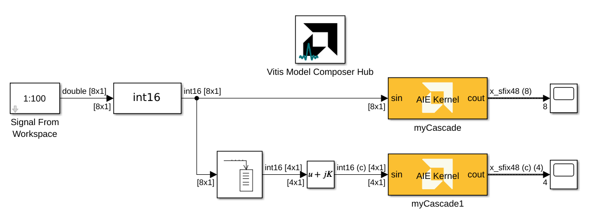

# AIE Kernel

This block allows you to import an AI Engine kernel.  

  

## Library

AI Engine/User-Defined Functions

## Description

The AIE Kernel block enables you to import an AI Engine kernel, which is a C/C++ program. This block supports importing Window, Buffer, Stream, Cascade, and Run time parameter as arguments to the kernel function. Additionally, this block allows you to import a function template with typename template parameter T, and a non-type (integral) template parameter N.

If your kernel is a class based kernel, you should use the 
AIE Class block to import the kernel.

## Parameters
#### Kernel header file
Mandatory string. Name of the header file that contains the kernel function declaration. The string could be just the file name, a relative path to the file or an absolute path of the file. Use the browse button to choose the file.

#### Kernel function
Mandatory string. Name of the kernel function for which the block is to be created. This function should be declared in the kernel header file. 

#### Kernel init function
Optional string. Name of the initialization function used by the kernel function.

#### Kernel source file
Mandatory string. Name of the source file that contains the kernel function definition. The string could be the file name, a relative path to the file or an absolute path of the file.

#### Kernel search paths
Optional vector of strings. If the kernel header file or the kernel source file are not found using the value provided through the 'Kernel header file' or 'Kernel source file' fields respectively, then the paths provided through 'Kernel search paths' are used to find the files.

This parameter allows use of environment variables while specifying paths for the kernel header file and the kernel source file. The environment variable can be used in either ${ENV} or $ENV format. 

#### Preprocessor options
Optional preprocessor arguments for downstream compilation with specific preprocessor options.

The following two preprocessor option formats are accepted and multiple can be selected: -Dname and -Dname=definition separated by a comma. That is, the optional argument must begin with -D and if the option definition value is not provided, it is assumed to be 1.

## Examples

***Click on the images below to open each model.***

This example shows import of kernel functions with int16 real and complex inputs and outputs.

## Related blocks
Use [AIE Class](../AIE_Class_Kernel_Function/README.md) block to import a class based kernel.

Use [AIE Graph](../AIE_Graph_Function/README.md) block to import an AI Engine graph.

