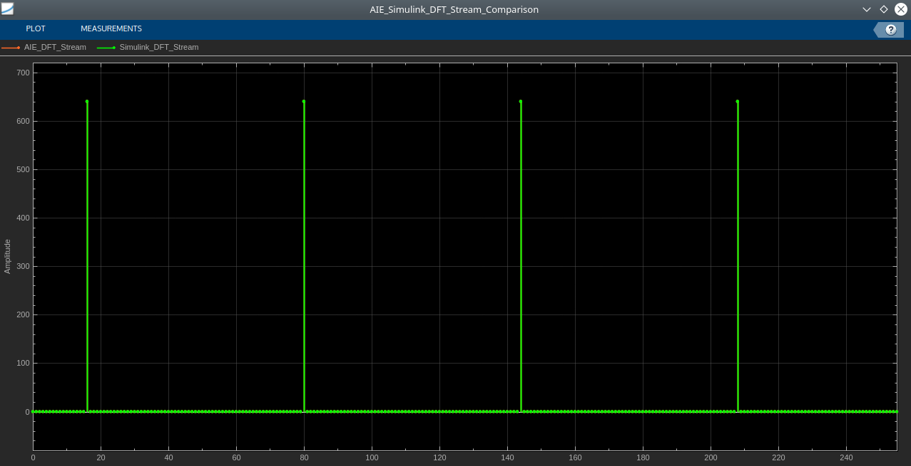

# DFT Stream
Stream-based DFT implementation targeted for AI Engines.
  
  

## Library

AI Engine/DSP/Stream IO

## Description

Stream-based DFT implementation targeted for AI Engines.
## Parameters

### Main  
#### Input/Output Data Type
Set the input/output data type.

#### Point Size (DFT Size)
This is an unsigned integer which describes the point size of the transformation. This must be 2^N, where N is in the range 3 to 7 inclusive.

#### Number Of Frames Per Window 
Describes the total number of frames used as an input to the DFT block per window.
 
#### Scale Output Down by 2^
Describes the power of 2 shift down applied before output. For _cfloat_ data type, the value for this parameter must be zero. 

####  Number of Cascade Stages
This determines the number of kernels the DFT will be divided over in series to improve throughput. For int data types, and DFT size of 2^N, the maximum cascade length is N/2 when N is even and (N+1)/2 when N is odd. For float data type, the maximum cascade length is N.

### Constraints
Click on the button given here to access the constraint manager and add or update constraints for each kernel. If you set the "Number of cascade stages" parameter to a value greater than one, multiple kernels will be used to process the input. You can use the constraint manager to optimize the performance of your design by setting specific constraints for each kernel (in this case, you need to first run your design). Adding constraints will not affect the functional simulation in Simulink. Constraints will only affect the generated graph code, cycle approximate AIE simulation (System C), and behavior in hardware.

If you are using non-default constraints for any of the kernels for the block, an asterisk (*) will be displayed next to the button.

## Examples

**DFT Stream Block Example:**

**AIE and Simulink DFT Stream Output Spectrum Comparison:**

