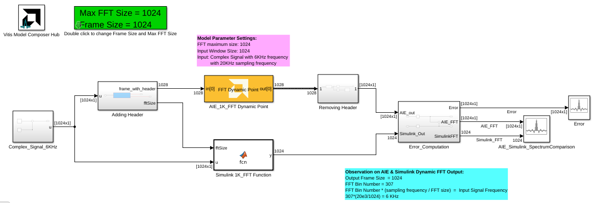
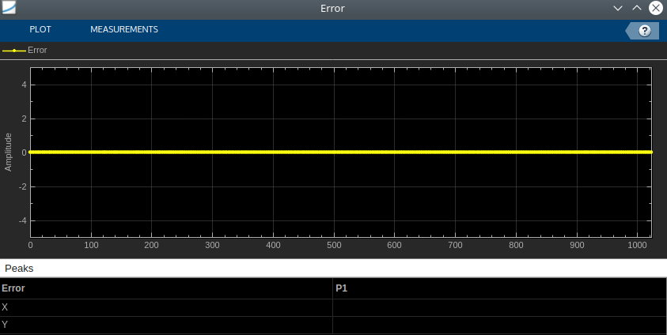
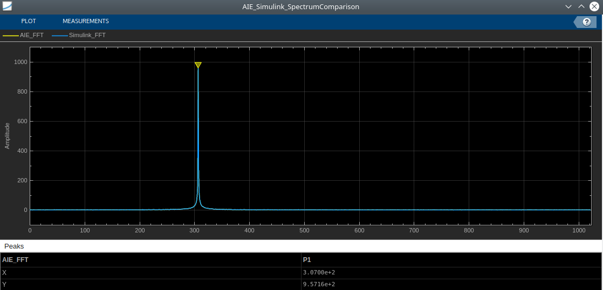
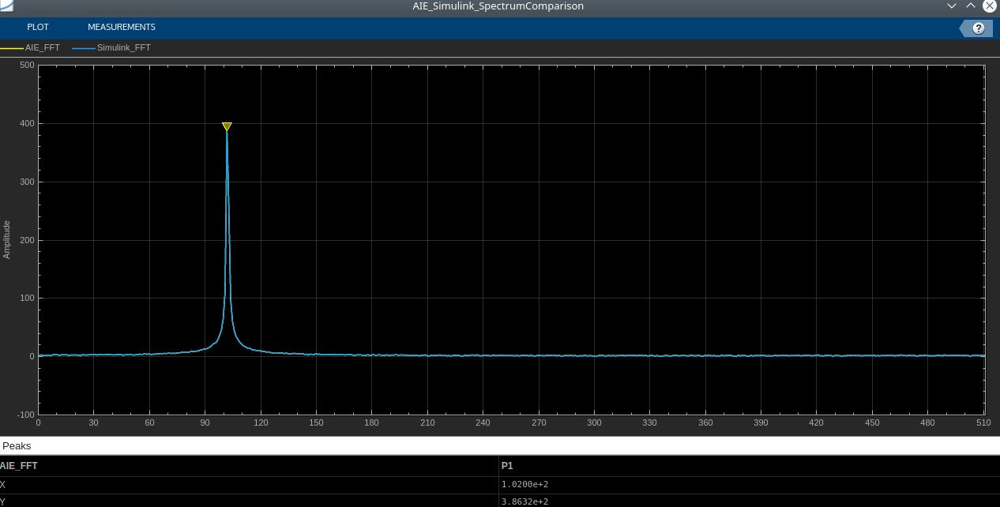

# FFT Dynamic Point
FFT Dynamic Point implementation targeted for AI Engines.
  
  

## Library

AI Engine/DSP/Buffer IO

## Description

FFT Dynamic Point implementation targeted for AI Engines. This block
supports performing different lengths of FFT on different input data
windows. Each window must be preceded by a 256-bit header which
describes run-time parameters of that window. The format of the header
is described below.

**Note**:

- Every input frame must be prepended by a header.
- If the FFT size (N) is smaller than the frame size, the block takes
  the N point FFT of the first N samples in the input frame, and
  discards the rest of the samples in the frame.
- If the frame size is an integer multiple (M) of max FFT size, M FFT
  iterations will be performed on a given input frame, resulting in
  multiple iterations of output samples, reducing the number of times
  the kernel needs to be triggered to process a given number of input
  data samples. As a result, the overheads incurred during kernel
  triggering are reduced and overall performance is increased


| Index      | Field Name          | Description  |
| :------------- |:-------------| :-----|
| 1     | Direction |0 = Inverse FFT <br /> 1= Forward FFT |
| 2      |Point size (radix 2 stages)     |Point size described as power of 2. For example, value '5' describes a point size of '32' |
| 3 |Reserved     |   Reserved |
| 4 |Status (output only)           |0 = Legal point size <br /> 1 = Illegal point size     |


## Parameters

### Main  
#### Input Data Type/Output Data Type

Describes the type of individual data samples input/output of the
  dynamic point FFT. It can be cint16, cint32, cfloat types.

#### Twiddle factor data type
Describes the data type of the twiddle factors of the transform. It must be one of `cint16`, `cint32`, or `cfloat` and must also satisfy the following rules:
* 32-bit twiddle factors are only supported when the input/output data type is also 32-bit.
* The twiddle factor data type must be an integer type if the input/output data type is an integer type.
* The twiddle factor data type must be `cfloat` if the input/output data type is a float type.

#### FFT Maximum Size

Specifies the maximum FFT size that is supported by Dynamic point FFT.
  You can perform different lengths of FFT on different input data
  windows. It must be a power of 2 with a minimum value of 16. The
  maximum value supported by the library element is 65536.

#### Input Window Size

Specifies the number of samples in the input window excluding the
  header. The value must be in the range 8 to 1024 and the default
  value is 64.

#### Scale Output down by 2^

Describes the power of 2 shift down applied to output. It must be in the range 0 to 61.

#### Rounding mode

Describes the selection of rounding to be applied during the shift down stage of processing.

The following modes are available:
* **Floor:** Truncate LSB, always round down (towards negative infinity).
* **Ceiling:** Always round up (towards positive infinity).
* **Round to positive infinity:** Round halfway towards positive infinity.
* **Round to negative infinity:** Round halfway towards negative infinity.
* **Round symmetrical to infinity:** Round halfway towards infinity (away from zero).
* **Round symmetrical to zero:** Round halfway towards zero (away from infinity).
* **Round convergent to even:** Round halfway towards nearest even number.
* **Round convergent to odd:** Round halfway towards nearest odd number.

No rounding is performed on the **Floor** or **Ceiling** modes. Other modes round to the nearest integer. They differ only in how they round for values that are exactly between two integers.

#### Saturation mode

Describes the selection of saturation to be applied during the shift down stage of processing.

The following modes are available:
* **None:** No saturation is performed and the value is truncated on the MSB side.
* **Asymmetric:** Rounds an n-bit signed value in the range `-2^(n-1)` to `2^(n-1)-1`.
* **Symmetric:** Rounds an n-bit signed value in the range `-2^(n-1)-1` to `2^(n-1)-1`.

####  Number of Cascade Stages
This determines the number of kernels the FFT will be divided over in series to improve throughput. For int data types, and FFT size of 2^N, the maximum cascade length is N/2 when N is even and (N+1)/2 when N is odd. For float data type, the maximum cascade length is N.

### Constraints
Click on the button given here to access the constraint manager and add or update constraints for each kernel. If you set the "Number of cascade stages" parameter to a value greater than one, multiple kernels will be used to process the input. You can use the constraint manager to optimize the performance of your design by setting specific constraints for each kernel (in this case, you need to first run your design). Adding constraints will not affect the functional simulation in Simulink. Constraints will only affect the generated graph code, cycle approximate AIE simulation (System C), and behavior in hardware.

<div class="noteBox">
If you are using non-default constraints for any of the kernels for the block, an asterisk (*) will be displayed next to the button.
</div>

## Examples

### Example Design
For an example using the FFT block where the output is compared with the MATLAB FFT function click [here](https://github.com/Xilinx/Vitis_Model_Composer/tree/HEAD/Examples/AIENGINE/DSPlib/Dynamic_FFT).

### Example of Header Format
To implement the 32-point size FFT of 'cint16' datatype, the format of
the header that should be prepended to the input data window is as follows:

 

### Example input to Dynamic Point FFT
To implement the FFT of different sizes, say, 64, 32 and 128, of type
cint32, the format of the input should be as follows.

``` pre
complex([1 6 0 0 ones(1,64) 1 5 0 0 ones(1,32) 1 7 0 0 ones(1,128)])
```

The terms "ones(1,X)" in the expression above are just replacements for the data that we are applying the FFT to.

**FFT Dynamic Point Block Example1:**



**Simulink Dynamic Point FFT function:**

``` pre
function y = fcn(fftSize, u, frame_size, max_fft_size)

out = complex(zeros(frame_size,1));

for i = 0:frame_size/max_fft_size-1
    frame_fft = fft(double(u(i*max_fft_size+1:(i+1)*max_fft_size)),fftSize);
    out(i*max_fft_size+1:(i+1)*max_fft_size) = [frame_fft; zeros(max_fft_size - fftSize,1)];
end
y = single(out(1:frame_size));
```

**Difference between AIE FFT and Simulink FFT block outputs:**



**AIE Dynamic Point FFT and Simulink Dynamic Point FFT Output Spectrum Comparison:**



**FFT Dynamic Point Block Example2:**


**Difference between AIE FFT and Simulink FFT block outputs:**


**AIE Dynamic Point FFT and Simulink Dynamic Point FFT Output Spectrum Comparison:**



## Related blocks
[FFT](../FFT/README.md) is another FFT block that uses buffer interface.

[FFT Stream](../FFT_Stream/README.md) is another FFT block that uses stream interface instead of buffer interface and is also SSR capable.

## References
This block uses the Vitis DSP library implementation of FFT. For more details on this implementation please click [here](https://docs.xilinx.com/r/en-US/Vitis_Libraries/dsp/user_guide/L2/func-fft.html).
