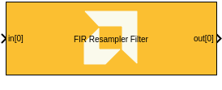
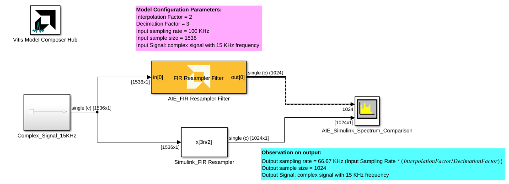
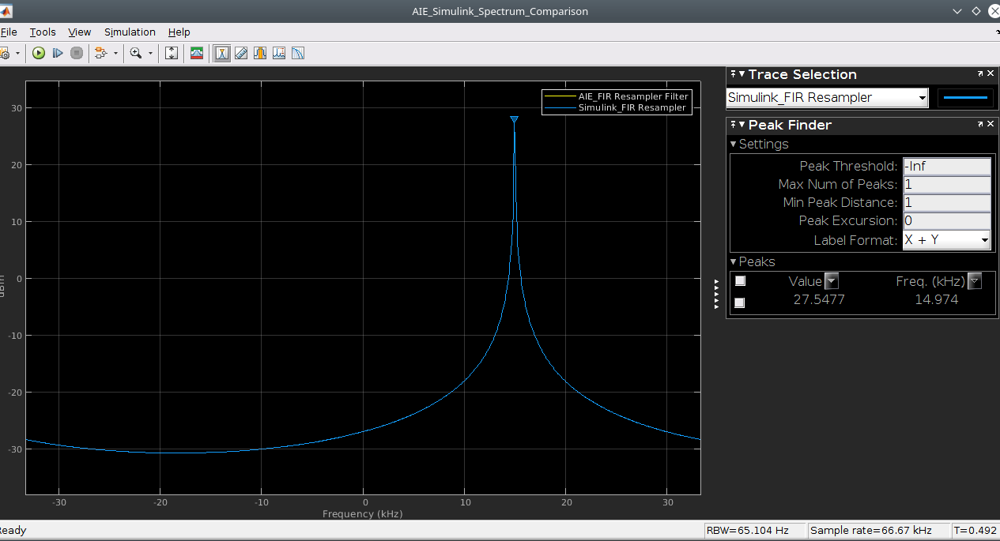
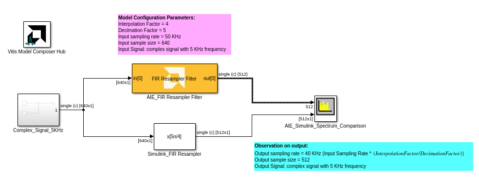
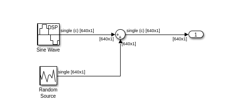
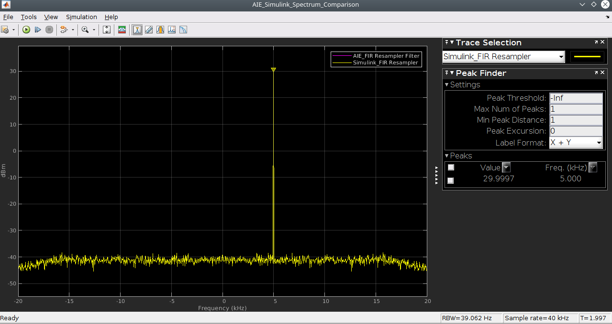

# FIR Resampler Filter

  
  

## Library

AI Engine/DSP/Window IO

## Description

This block implements the FIR Fractional Asymmetric Interpolation and
Decimation filter targeted for AI Engines.

**Note**: The FIR Fractional Interpolation block has been deprecated. Please
use the FIR Resampler Filter block instead.

## Parameters

### Main  
#### Input/Output data type  
Describes the type of individual data samples input to and output from
the filter function. int16, cint16, int32, cint32, float, cfloat.

#### Filter coefficients data type  
Describes the type of individual coefficients of the filter taps. It
should be one of int16, cint16, int32, cint32, float, cfloat and must
also satisfy the following rules:

  - Complex types are only supported when the Input/Output data type is
  also complex.
  - 32-bit types are only supported when the Input/Output data type is
  also a 32-bit type.
  - Filter coefficients data type must be an integer type if the
  Input/Output data type is an integer type.
  - Filter coefficients data type must be a float type if the Input/Output
  data type is a float type.

#### Specify filter coefficients via input port  
When this option is enabled, the tool allows you to specify reloadable
filter coefficients via input port.

#### Filter coefficients  
This field should be specified with the asymmetric filter coefficients
and must be in the range 4 to 240 inclusive.

#### Interpolation factor  
An unsigned integer which describes the Interpolation factor of the
filter. It must be in the range 3 to 16.

#### Decimation factor  
An unsigned integer which describes the decimation factor of the filter.
It must be in the range 2 to 16. The decimation factor should be less
that the interpolation factor and should not be divisible by the
interpolation factor.

#### Input window size (Number of samples)  
Describes the number of samples used as an input to the filter function.
The number of values in the output window will be the input window size
multipled by the Interpolation factor and divided by the decimation
factor. In this instance it would result in a fraction number of output
samples which would be rounded down.

#### Scale output down by 2^  
Describes the power of 2 shift down applied to the accumulation of FIR
terms before output. It must be in the range 0 to 61.

#### Rounding mode  
Describes the selection of rounding to be applied during the shift down
stage of processing. The rounding options are as follows:

1.  Floor (truncate)
2.  Ceiling
3.  Round to positive infinity
4.  Round to negative infinity
5.  Round symmetrical to infinity
6.  Round symmetrical to zero
7.  Round convergent to even
8.  Round convergent to odd

Modes 2 to 7 round to the nearest integer. They differ only in how they
round for the value of 0.5.

#### Number of cascade stages  
This determines the number of kernels the FIR will be divided over in series to improve throughput.

**FIR Resampler Filter Example1:**

**ComplexSignal_15KHz subsystem blocks:**

**AIE and Simulink Resampler Filter Output Spectrum Comparison:**

**FIR Resampler Filter Example2:**

**ComplexSignal_5KHz subsystem blocks:**

**AIE and Simulink Resampler Filter Output Spectrum Comparison:**

