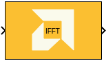

# IFFT

  
  

## Library

AI Engine/DSP/Window IO

## Description

This block implements the Inverse FFT targeted for AI Engines which use
the rounding method and saturates the output samples on overflow.

## Parameters

### Main  
#### Input/Output data type  
* Describes the type of individual data samples input to and output from
the filter function. Supported types are cint16, cint32 and cfloat.

#### IFFT size  
* This is an unsigned integer which describes the point size of the
transformation. This must be 2^N, where N is in the range 4 to 11
inclusive. However, for cint16 datatype, the IFFT size can be 2^12,
provided the IFFT receives and outputs data to/from kernels on the same
processor.

**Note**: To understand more on achieving the 4096 point size FFT, refer to
the AI Engine examples in
[GitHub](https://github.com/Xilinx/Vitis_Model_Composer).

#### Input Window Size (Number of Samples)  
* Describes the number of samples used as an input to the IFFT.

#### Scale output down by 2^  
* Describes the power of 2 to scale the result by prior to output.

### Advanced  
#### Target input throughput  
* Specifies the rate at which data samples should be processed. The
default value is 200.

#### Specify the number of cascade stages  
* When this option is not enabled, the tool will determine the filter
configuration that best achieves the specified input sampling rate. When
this option is enabled and the 'Number of cascade stages' is specified,
the tool will guarantee the same. In such cases, however, the specified
sample rate constraint may not be achieved.

#### Number of cascade stages  
* This determines the number of kernels the FFT will be divided over in
series to improve throughput.

--------------
Copyright (C) 2023 Advanced Micro Devices, Inc. All rights reserved.
SPDX-License-Identifier: MIT
