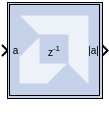

# Vector Absolute

The Vector Absolute block outputs the absolute value of the input of
vector type.

## Description

This block enables 1-D vector support for the primary block operation.

## Parameters

### Basic tab  
#### Precision  
This parameter allows you to specify the output precision for
fixed-point arithmetic. Floating-point arithmetic output will always be
Full precision:

##### Full  
The block uses sufficient precision to represent the result without
error.

##### User Defined:  
If you do not need full precision, this option allows you to specify a
reduced number of total bits and/or fractional bits.

#### Fixed-point Output Type  
Arithmetic type:

##### Signed (2’s comp)  
The output is a Signed (2’s complement) number.

##### Unsigned  
The output is an Unsigned number.

#### Fixed-point Precision  
#####  Number of bits  
Specifies the bit location of the binary point of the output number,
where bit zero is the least significant bit.

##### Binary point  
Position of the binary point. in the fixed-point output.

#### Quantization  
Refer to the section [Overflow and
Quantization](common-options-in-block-parameter-dialog-boxes-aa1032308.html#val1538085362909__aa1032322).

#### Overflow  
Refer to the section [Overflow and
Quantization](common-options-in-block-parameter-dialog-boxes-aa1032308.html#val1538085362909__aa1032322).

Other parameters used by this block are explained in the topic [Common
Options in Block Parameter Dialog
Boxes](common-options-in-block-parameter-dialog-boxes-aa1032308.html).

## LogiCORE™ Documentation

[LogiCORE IP Floating-Point Operator
v7.1](https://docs.xilinx.com/access/sources/ud/document?isLatest=true&url=pg060-floating-point&ft:locale=en-US)
