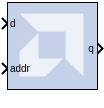
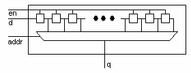

# Addressable Shift Register

The Addressable Shift Register block is a variable-length shift
register in which any register in the delay chain can be addressed and
driven onto the output data port.

## Description 
The block operation is most easily thought of as a chain of registers,
where each register output drives an input to a multiplexer, as shown
below. The multiplexer select line is driven by the address port (addr).
The output data port is shown below as q.

  

The Addressable Shift Register has a maximum depth of 1024 and a minimum
depth of 2. The address input port, therefore, can be between 1 and 10
bits (inclusive). The data input port width must be between 1 and 255
bits (inclusive) when this block is implemented with the
LogiCORE™ (for example, when Use behavioral HDL (otherwise use core) is
unchecked).

In hardware, the address port is asynchronous relative to the output
port. In the block S-function, the address port is therefore given
priority over the input data port, for example, on each successive
cycle, the addressed data value is read from the register and driven to
the output before the shift operation occurs. This order is needed in
the Simulink® software model to guarantee one clock cycle of latency
between the data port and the first register of the delay chain. (If the
shift operation were to come first, followed by the read, then there
would be no delay, and the hardware would be incorrect.)

### Block Interface

The block interface (inputs and outputs as seen on the Addressable Shift
Register icon) are as follows:

| Signal | Description              |
|--------|--------------------------|
| d      | data input               |
| addr   | address                  |
| en     | enable signal (optional) |

| Signal | Description |
|--------|-------------|
| q      | data output |

## Parameters

The Block Parameters dialog box can be invoked by double-clicking the
icon in your Simulink® model.

### Basic tab  
Parameters specific to this block are as follows:

#### Infer maximum latency (depth) using address port width  
You can choose to allow the block to automatically determine the depth
or maximum latency of the shift-register-based on the bit-width of the
address port.

#### Maximum latency (depth)  
In the case that the maximum latency is not inferred (previous option),
the maximum latency can be set explicitly.

#### Initial value vector  
Specifies the initial register values. When the vector is longer than
the shift register depth, the vector's trailing elements are discarded.
When the shift register is deeper than the vector length, the shift
register's trailing registers are initialized to zero.

Other parameters used by this block are explained in the topic [Common
Options in Block Parameter Dialog
Boxes](../../GEN/common-options/README.md).

### Implementation tab  
Parameters specific to this block are as follows:

#### Optimization  
You can choose to optimize for Resource (minimum area) or for Speed
(maximum performance).

## LogiCORE Documentation

RAM-Based Shift Register LogiCORE IP Product Guide
([PG122](https://docs.xilinx.com/access/sources/ud/document?isLatest=true&url=pg122-c-shift-ram&ft:locale=en-US))

Floating-Point Operator LogiCORE IP Product Guide
([PG060](https://docs.xilinx.com/access/sources/ud/document?isLatest=true&url=pg060-floating-point&ft:locale=en-US))

--------------
Copyright (C) 2024 Advanced Micro Devices, Inc.
All rights reserved.
