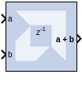

# AddSub

## Description
The AddSub block implements an adder/subtractor. The operation
can be fixed (Addition or Subtraction) or changed dynamically under
control of the sub mode signal.

## Parameters

### Basic tab  
Parameters specific to the Basic tab are as follows:

#### Operation  
Specifies the block operation to be Addition, Subtraction, or Addition/
Subtraction. When Addition/Subtraction is selected, the block operation
is determined by the sub input port, which must be driven by a Boolean
signal. When the sub input is 1, the block performs subtraction.
Otherwise, it performs addition.

#### Provide carry-in port  
When selected, allows access to the carry-in port, cin.

#### Provide carry-out port  
When selected, allows access to the carry-out port, cout. The carry-out
port is available only when User defined precision is selected, the
inputs and output are unsigned, and the number of output integer bits
equals x, where x = max (integer bits a, integer bits b).

#### Latency  
The Latency value defines the number of sample periods by which the
block's output is delayed. One sample period might correspond to
multiple clock cycles in the corresponding FPGA implementation (for
example, when the hardware is over-clocked with respect to the Simulink
model). Model Composer will not perform extensive pipelining unless you
select the Pipeline for maximum performance option (on the
Implementation tab, described below); additional latency is usually
implemented as a shift register on the output of the block.

### Output tab  
#### Precision  
This parameter allows you to specify the output precision for
fixed-point arithmetic. Floating point arithmetic output will always be
Full precision.

##### Full  
The block uses sufficient precision to represent the result without
error.

##### User Defined  
If you do not need full precision, this option allows you to specify a
reduced number of total bits and/or fractional bits.

#### Fixed-point Output Type  
##### Arithmetic Type  
###### Signed (2’s comp)  
The output is a Signed (2’s complement) number.

###### Unsigned  
The output is an Unsigned number.

##### Fixed -point Precision  
###### Number of bits  
Specifies the bit location of the binary point of the output number,
where bit zero is the least significant bit.

###### Binary point  
Position of the binary point in the fixed-point output.

#### Quantization  
Refer to the section [Overflow and
Quantization](../../GEN/common-options/README.md).

#### Overflow  
Refer to the section [Overflow and
Quantization](../../GEN/common-options/README.md).

### Implementation tab  
Parameters specific to the Implementation tab are as follows:

#### Use behavioral HDL (otherwise use core)  
The block is implemented using behavioral HDL. This gives the downstream
logic synthesis tool maximum freedom to optimize for performance or
area.

  **Note**: For Floating-point operations, the block always uses the
Floating-point Operator core.

### Core Parameters  
#### Pipeline for maximum performance  
The LogiCORE can be internally pipelined to optimize for speed
instead of area. Selecting this option puts all user defined latency
into the core until the maximum allowable latency is reached. If the
Pipeline for maximum performance option is not selected and latency is
greater than zero, a single output register is put in the core and
additional latency is added on the output of the core.

The Pipeline for maximum performance option adds the pipeline registers
throughout the block, so that the latency is distributed, instead of
adding it only at the end. This helps to meet tight timing constraints
in the design.

#### Implement using  
Core logic can be implemented in Fabric, or in a DSP48, if a DSP48 is
available in the target device. The default is Fabric.

Other parameters used by this block are explained in the topic [Common
Options in Block Parameter Dialog
Boxes](../../GEN/common-options/README.md).

## LogiCORE™ Documentation

Adder/Subtractor LogiCORE IP Product Guide
([PG120](https://docs.xilinx.com/access/sources/ud/document?isLatest=true&url=pg120-c-addsub&ft:locale=en-US))

Floating-Point Operator LogiCORE IP Product Guide
([PG060](https://docs.xilinx.com/access/sources/ud/document?isLatest=true&url=pg060-floating-point&ft:locale=en-US))
