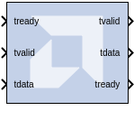

# AXI FIFO

The Xilinx AXI FIFO block implements a FIFO memory queue with an
AXI-compatible block interface.

## Block Interface

Write Channel  
tready  
Indicates that the slave can accept a transfer in the current cycle.

tvalid  
Indicates that the master is driving a valid transfer. A transfer takes
place when both tvalid and tready are asserted.

tdata  
The primary input data channel.

&nbsp;

Read Channel  
tdata  
The primary output for the data.

tready  
Indicates that the slave can accept a transfer in the current cycle.

tvaild  
Indicates that the slave is accepting a valid transfer. A transfer takes
place when both tvalid and tready are asserted.

## Block Parameters

The block parameters dialog box can be invoked by double-clicking the
icon in your Simulink® model.

Basic tab  
Parameters specific to the Basic tab are as follows.

Data Port Parameters  
FIFO depth  
Specifies the number of words that can be stored. Range 16-128K.

Actual FIFO depth  
A report field that indicates the actual FIFO depth. The actual depth of
the FIFO depends on its implementation and the features that influence
its implementation.

Optional Ports  
TDATA  
The primary payload that is used to provide the data that is passing
across the interface. The width of the data payload is an integer number
of bytes.

TDEST  
Provides routing information for the data stream.

TSTRB  
The byte qualifier that indicates whether the content of the associated
byte of TDATA is processed as a data byte or a position byte. For a
64-bit DATA, bit 0 corresponds to the least significant byte on DATA,
and bit 7 corresponds to the most significant byte. For example:

- STROBE\[0\] = 1b, DATA\[7:0\] is valid
- STROBE\[7\] = 0b, DATA\[63:56\] is not valid

TREADY  
Indicates that the slave can accept a transfer in the current cycle.

TID  
The data stream identifier that indicates different streams of data.

TUSER  
The user-defined sideband information that can be transmitted alongside
the data stream.

TKEEP  
The byte qualifier that indicates whether the content of the associated
byte of TDATA is processed as part of the data stream. Associated bytes
that have the TKEEP byte qualifier de-asserted are null bytes and can be
removed from the data stream. For a 64-bit DATA, bit 0 corresponds to
the least significant byte on DATA, and bit 7 corresponds to the most
significant byte. For example:

- KEEP\[0\] = 1b, DATA\[7:0\] is a NULL byte
- KEEP \[7\] = 0b, DATA\[63:56\] is not a NULL byte

TLAST  
Indicates the boundary of a packet.

arestn  
Adds arestn (global reset) port to the block.

Data Threshold Parameters  
Provide FIFO occupancy DATA counts  
Adds data_count port to the block. This port indicates the number of
words written into the FIFO. The count is guaranteed to never
under-report the number of words in the FIFO, to ensure the user never
overflows the FIFO. The exception to this behavior is when a write
operation occurs at the rising edge of write clock; that write operation
will only be reflected on WR_DATA_COUNT at the next rising clock edge. D
= log2(FIFO depth)+1

&nbsp;

Implementation tab  
FIFO Options

FIFO implementation type  
Specifies how the FIFO is implemented in the FPGA. Possible options are:
Common Clock block RAM and Common Clock Distributed RAM. The
XPM_FIFO_AXIS macro will be inferred or implemented when the design is
compiled. For information on the XPM_FIFO_AXIS Xilinx Parameterized
Macro (XPM), refer to UltraScale Architecture Libraries Guide
([UG974](https://docs.xilinx.com/access/sources/dita/map?Doc_Version=2022.2%20English&url=ug974-vivado-ultrascale-libraries)).

Other parameters used by this block are explained in the topic [Common
Options in Block Parameter Dialog
Boxes](common-options-in-block-parameter-dialog-boxes-aa1032308.html).
