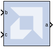

# BitBasher

The BitBasher block performs slicing, concatenation and
augmentation of inputs attached to the block.



## Description
The operation to be performed is described using Verilog syntax which is
detailed in this document. The block can have up to four output ports.
The number of output ports is equal to the number of expressions. The
block does not cost anything in hardware.

## Parameters

### Basic tab  
Parameters specific to the Basic tab are as follows.

#### BitBasher Expression  
Bitwise manipulation expression based on Verilog Syntax. Multiple
expressions (limited to a maximum of 4) can be specified using new line
as a separator between expressions.

### Output Type tab  
#### Output  
This refers to the port on which the data type is specified.

#### Output type  
Arithmetic type to be forced onto the corresponding output.

#### Binary Point  
Binary point location to be forced onto the corresponding output.

Other parameters used by this block are explained in the topic [Common
Options in Block Parameter Dialog
Boxes](../../GEN/common-options/README.md).

## Supported Verilog Constructs

The BitBasher block only supports a subset of Verilog expression
constructs that perform bitwise manipulations including slice,
concatenation, and repeat operators. All specified expressions must
adhere to the following template expression:

`output_var = {bitbasher_expr}`

`bitbasher_expr`: A slice, concat or repeat expression based on Verilog
syntax or simply an input port identifier.

`output_var`: The output port identifier. An output port with the name
output_var will appear on the block and will hold the result of the wire
expression bitbasher_expr.

## Concat

`output_var = {bitbasher_expr1, bitbasher_expr2, bitbasher_expr3}`

The concat syntax is supported as shown above. Each of `bitbasher_exprN`
could either be an expression or simply an input port identifier.

The following are some examples of this construct:

`a1 = {b,c,d,e,f,g}` 

`a2 = {e}` 

`a3 = {b,{f,c,d},e}`


## Slice

``` pre
output_var = {port_identifier[bound1:bound2]}...(1) 
output_var = {port_identifier[bitN]}...(2)
```

`port_identifier`: The input port from which the bits are extracted.

`bound1`, `bound2`: Non-negative integers that lie between 0 and
(bit-width of port_identifier – 1)

`bitN`: Non-negative integers that lie between 0 and (bit-width of
port_identifier – 1)

As shown above, there are two schemes to extract bits from the input
ports. If a range of consecutive bits need to be extracted, then the
expression of the following form should be used.

``` pre
output_var = {port_identifier[bound1:bound2]}...(1)
```

If only one bit is to be extracted, then the alternative form should be
used.

``` pre
output_var = {port_identifier[bitN]}..(2)
```

The following are some examples of this construct:

``` pre
a1 = {b[7:3]}
```

`a1` holds bits 7 through 3 of input `b` in the same order in which they
appear in bit `b` (for example, if `b` is 110110110 then `a1` is 10110).

``` pre
a2 = {b[3:7]}
```

`a2` holds bits 7 through 3 of input `b` in the reverse order in which
they appear in bit `b` (for example, if `b` is 110100110 then `a2` is
00101).

``` pre
a3 = {b[5]}
```

`a3` holds bit 5 of input `b`.

``` pre
a4 = {b[7:5],c[3:9],{d,e}}
```

The above expression makes use of a combination of slice and concat
constructs. Bits 7 through 5 of input `b`, bits 3 through 9 of input `c`
and all the bits of `d` and `e` are concatenated.

## Repeat

``` pre
output_var = {N{bitbasher_expr}}
```

`N`: A positive integer that represents the repeat factor in the
expression

The following are some examples of this construct:

``` pre
a1 = {4{b[7:3]}}
```

The above expression is equivalent to
`a1 = {b[7:3], b[7:3], b[7:3], b[7:3]}`.

``` pre
a2 = {b[7:3],2{c,d}}
```

The above expression is equivalent to `a2 = {b[7:3],c,d,c,d}`.

### Constants

Binary Constant: N'bbin_const

Octal Constant: N'ooctal_const

Decimal Constant: N'doctal_const

Hexadecimal Constant: N'hoctal_const

N: A positive integer that represents the number of bits that are used
to represent the constant

bin_const: A legal binary number string made up of 0 and 1

octal_const: A legal octal number string made up of 0, 1, 2, 3, 4, 5, 6
and 7

decimal_const: A legal decimal number string made up of 0, 1, 2, 3, 4,
5, 6, 7, 8 and 9

hexadecimal_const: A legal binary number string made up of 0, 1, 2, 3,
4, 5, 6, 7, 8, 9, a, b, c, d, e and f

A constant can only be used to augment expressions already derived from
input ports. In other words, a BitBasher block cannot be used to simply
source constant like the [Constant](../../HDL/constant/README.md) block.

The following examples make use of this construct:

``` pre
a1 = {4'b1100, e}
```

if `e` were 110110110 then `a1` would be 1100110110110.

``` pre
a1 = {4'hb, e}
```

if `e` were 110110110 then `a1` would be 1101110110110.

``` pre
a1 = {4'o10, e}
```

if `e` were 110110110 then `a1` would be 1000110110110.

## Limitations

- Does not support masked parameterization on the bitbasher expressions.
- An expression cannot contain only constants, that is, each expression
  must include at least one input port.

--------------
Copyright (C) 2024 Advanced Micro Devices, Inc.
All rights reserved.
