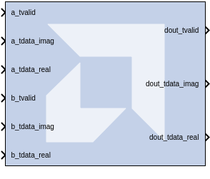

# Complex Multiplier 6.0

The Complex Multiplier block implements AXI4-Stream compliant,
high-performance, optimized complex multipliers for devices based on
user-specified options.

## Description

The two multiplicand inputs and optional rounding bit are input on
independent AXI4-Stream channels as slave interfaces and the resulting
product output using an AXI4-Stream master interface.

Within each channel, operands, and the results are represented in signed
two’s complement format. The operand widths. and the result width are
parameterizable.

## Parameters

### Page 1  
Parameters specific to the Basic tab are:
#### Channel A Options  
##### Has TLAST  
Adds a tlast input port to the A channel of the block.

##### Has TUSER  
Adds a tuser input port to the A channel of the block.

##### TUSER Width  
User defined, maximum Limit range (1, 256).

#### Channel B Options  
##### Has TLAST  
Adds a tlast input port to the B channel of the block.

##### Has TUSER  
Adds a tuser input port to the B channel of the block.

##### TUSER Width  
User defined. maximum Limit range (1, 256).

#### Multiplier Construction Options  
##### Use_Mults  
Use embedded multipliers/XtremeDSP slices.

##### Use_LUTs  
Use LUTs in the fabric to construct multipliers.

#### Optimization Goal  
Only available if Use_Mults is selected.

##### Resources  
Uses the 3-real-multiplier structure. However, a 4-real-multiplier
structure is used when the 3- l- multiplier structure uses more
multiplier resources.

##### Performance  
Always uses the 4-real multiplier structure to allow the best frequency
performance to be achieved.

#### Flow Control Options  
##### Blocking  
Selects “Blocking” mode. In this mode, the lack of data on one input
channel does block the execution of an operation if data is received on
another input channel.

##### NonBlocking  
Selects “Non-Blocking” mode. In this mode, the lack of data on one input
channel does not block the execution of an operation if data is received
on another input channel.

### Page 2 tab  
#### Output Product Range  
Select the output bit width. The values are automatically set to provide
the full-precision product when the A and B operand widths are set. The
output is sign-extended if required.

The natural output width for complex multiplication is (APortWidth +
BPortWidth + 1). When the Output Width is set to be less than this, the
most significant bits of the result are those output; the remaining bits
will either be truncated or rounded according to Output Rounding option
selected. That is to say, the output MSB is now fixed at (APortWidth +
BPortWidth). For details please refer to the document Complex Multiplier LogiCORE IP Product Guide ([PG104](https://docs.xilinx.com/access/sources/ud/document?isLatest=true&url=pg104-cmpy&ft:locale=en-US)).

#### Output Rounding  
If rounding is required, the Output LSB must be greater than zero.

##### Truncate  
Truncate the output.

##### Random_Rounding  
When this option is selected, a ctrl_tvalid and ctrl_tdata input port is
added to the block. Bit 0 of ctrl_tdata input determines the particular
type if rounding for the operation. For details, refer to the Rounding
section of the Complex Multiplier LogiCORE IP Product Guide
([PG104](https://docs.xilinx.com/access/sources/ud/document?isLatest=true&url=pg104-cmpy&ft:locale=en-US)).

#### Channel CTRL Options  
The following options are activated when Random Rounding is selected.

##### Has TLAST  
Adds a ctrl_tlast input port to the block.

##### Has TUSER  
Adds a ctrl_user input port to the block.

#### TUSER Width  
Specifies the bit width of the ctrl_tuser input port.

#### Output TLAST Behavior  
Determines the behavior of the dout_tlast output port.

##### Null  
Output is null.

##### Pass_A_TLAST  
Pass the value of the a_tlast input port to the dout_tlast output port.

##### Pass B_TLAST  
Pass the value of the b_tlast input port to the dout_tlast output port.

##### Pass CTRL_TLAST  
Pass the value of the ctrl_tlast input port to the dout_tlast output
port.

##### OR_all_TLASTS  
Pass the logical OR of all the present TLAST input ports.

##### AND_all_TLASTS  
Pass the logical AND of all the present TLAST input ports.

#### Latency Configuration  

###### Automatic 
Block latency is automatically determined by Model Composer by
pipelining the underlying LogiCORE™ for maximum performance.

###### Manual  
You can adjust the block latency specifying the minimum block latency.

#### Minimum Latency  
Entry field for manually specifying the minimum block latency.

#### Control Signals  
##### ACLKEN  
Enables the clock enable (aclken) pin on the core. All registers in the
core are enabled by this control signal.

##### ARESETn  
Active-Low synchronous clear input that always takes priority over
ACLKEN. A minimum ARESETn active pulse of two cycles is required, since
the signal is internally registered for performance. A pulse of one
cycle resets the core, but the response to the pulse is not in the cycle
immediately following.

### Advanced tab  
Block Icon Display

#### Display shortened port names  
On by default. For example, when unchecked, dout_tvalid becomes
m_axis_dout_tvalid.

## LogiCORE™ Documentation

Complex Multiplier LogiCORE IP Product Guide
([PG104](https://docs.xilinx.com/access/sources/ud/document?isLatest=true&url=pg104-cmpy&ft:locale=en-US))

--------------
Copyright (C) 2024 Advanced Micro Devices, Inc.
All rights reserved.
