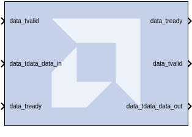
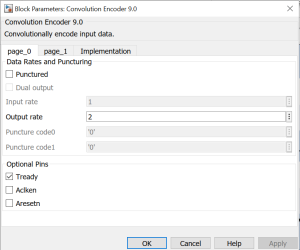

# Convolution Encoder 9.0

The Convolution Encoder block implements an encoder for
convolution codes. Ordinarily used in tandem with a Viterbi decoder,
this block performs forward error correction (FEC) in digital
communication systems. This block adheres to the AMBA® AXI4-Stream
standard.

## Description
Values are encoded using a linear feed forward shift register which
computes modulo-two sums over a sliding window of input data, as shown
in the figure below. The length of the shift register is specified by
the constraint length. The convolution codes specify which bits in the
data window contribute to the modulo-two sum. Resetting the block will
set the shift register to zero. The encoder rate is the ratio of input
to output bit length; thus, for example a rate 1/2 encoder outputs two
bits for each input bit. Similarly, a rate 1/ 3 encoder outputs three
bits for each input bit.

  
  

## Parameters

The following figure shows the Block Parameters dialog box.

### page_0 tab  
Parameters specific to the page_0 tab are as follows.
#### Data Rates and Puncturing  
* #### Punctured  
  Determines whether the block is punctured.

* #### Dual Output  
  Specifies a dual-channel punctured block.

* #### Input Rate  
  Punctured: Only the input rate can be modified. Its value can range from
2 to 12, resulting in a rate n/m encoder where n is the input rate and
n\<m\<2n.

* #### Output Rate  
  Not Punctured: Only the output rate can be modified. Its value can be
integer values from 2 to 7, resulting in a rate 1/2 or rate 1/7 encoder,
respectively

* #### Puncture Code0 and Code1  
  The two puncture pattern codes are used to remove bits from the encoded
data prior to output. The length of each puncture code must be equal to
the puncture input rate, and the total number of bits set to 1 in the
two codes must equal the puncture output rate (m) for the codes to be
valid. A 0 in any position indicates that the output bit from the
encoder is not transmitted. See the associated LogiCORE™ data sheet for
an example.

#### Optional Pins  
* #### Tready  
  Adds a tready pin to the block. Indicates that the slave can accept a
transfer in the current cycle.

* #### Aclken  
  Adds a aclken pin to the block. This signal carries the clock enable and
must be of type Bool.

* #### Aresetn  
  Adds a aresetn pin to the block. This signal resets the block and must
be of type `Bool`. The signal must be asserted for at least 2 clock
cycles, however, it does not have to be asserted before the decoder can
start decoding. If this pin is not selected, Model Composer ties this
pin to inactive (high) on the core.

### page_1 tab  
Parameters specific to the page_1 tab are as follows.

#### Radix  
* #### Convolution code radix  
  Select Binary, Octal, or Decimal.

* #### Convolution  
  * #### Constraint length  
    Equals n+1, where n is the length of the constraint register in the
encoder.

  * #### Convolution code  
    Array of binary convolution codes. Output rate is derived from the array
length. Between 2 and 7 (inclusive) codes can be entered.

Other parameters used by this block are explained in the topic [Common
Options in Block Parameter Dialog
Boxes](common-options-in-block-parameter-dialog-boxes-aa1032308.html).

## LogiCORE™ Documentation

Convolutional Encoder LogiCORE IP Product Guide
([PG026](https://www.xilinx.com/cgi-bin/docs/ipdoc?c=convolution;v=latest;d=pg026_convolution.pdf))
