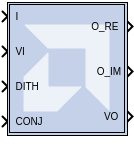

# Vector DDFS

The Vector DDFS block generates Real and Imaginary vector output signals
of desired frequency.

## Description

The input port I is used for providing the desired output frequency
value as a vector type.

The input port I value should be equal to:

*(desired output Frequency \* Sampling time \*2^(Frequency Resolution))*

The VI input port and VO output are used for synchronization purposes
with the other blocks in the design. The VO is just a delayed version of
VI based on the block latency. The DITH input port is used to turn
on/off the phase noise dithering feature. The CONJ input port is set to
'1' to conjugate the complex exponential output. The output ports, O_RE
and O_IM, generate Real and Imaginary components of the desired vector
output frequency signal.

### Data Type Support

- The input port I should be a signed fixed-point data type.
- The input port VI, DITH, and CONJ should be Boolean data types.

## Parameters

#### Super Sample Rate (SSR)  
This configurable GUI parameter is primarily used to control the
processing of multiple data samples on every sample period. This block
enables 1-D vector support for the primary block operation.

#### Frequency Resolution (bits)  
Defines the smallest incremental step in frequency that the block can
output. This should be an integer value.

#### Sin/Cos Table Depth  
Defines the depth of the Sin/Cos Table and should be an integer value.

#### Sin/Cos Table Width  
Defines the width of the Sin/Cos Table and should be an integer value.

## Examples

***Click on the images below to open the model.***

--------------
Copyright (C) 2024 Advanced Micro Devices, Inc.
All rights reserved.
