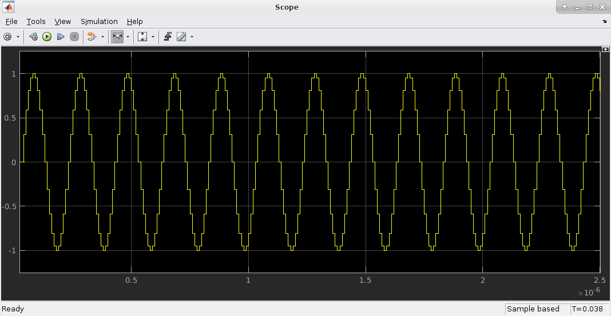
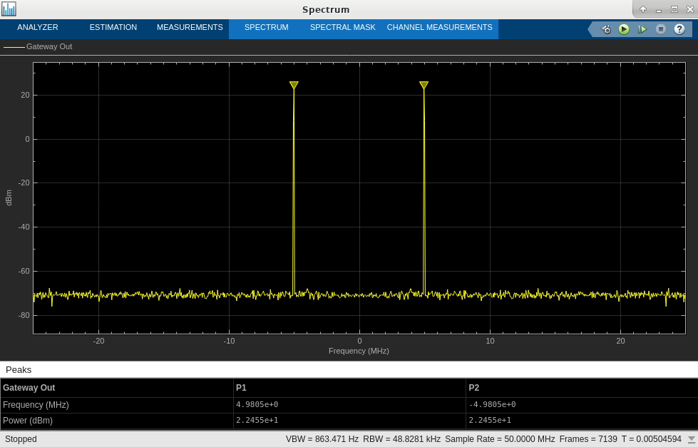

# Sine Wave

The Sine Wave block generates a sine wave, using simulation time
as the time source.

## Description

The Sine Wave block outputs a sinusoidal waveform. Outputs from
the block can be a sine wave, a cosine wave, or both. When implemented
in an FPGA or SoC, the Sine Wave block optimizes the block
parameters for your target device.

The output of the Sine Wave block is determined by this equation:

*y = sin (2π(k+o)/p)*

where:

p = number of time samples per sine wave period

k = repeating integer value that ranges from 0 to p-1

o = offset (phase shift) of the signal

In this block, Model Composer sets k equal to 0 at the first time step
and computes the block output, using the formula above. At the next time
step, Simulink increments k and re-computes the output of the block.
When k reaches p, Simulink resets k to 0 before computing the block
output. This process continues until the end of the simulation.

The output characteristic of the Sine Wave block is determined by:

* Samples per period = 2π / (Frequency \* Sample Time)

* Number of offset samples = Phase Offset \* Samples per period / 2π

The Sine Wave block is ideal for generating simple sine and cosine
waves. If your sine wave implementation will use more complicated
features such as a phase generator, multiple channel support, or AXI4
ports, use the [DDS Compiler 6.0](../../HDL/dds_compiler_v6_0/README.md) block in
your design instead of the Sine Wave block.

In the Vivado design flow, the Sine Wave block is inferred as "LogicCore
IP DDS Compiler v6.0" for code generation.

## Parameters

Parameters specific to the block are as follows:

### System Parameters  
#### Select the input format  
Specifies whether the frequency and phase offset inputs are entered as a
Frequency (Hz) or an angular velocity (Radians) value.

#### Frequency  
Specifies the frequency, either in Hertz or radians. The default is 1.

When "Explicit sample period" is enabled, the output frequency of this block may be different if the block's sample period differs from the Simulink system period setting in the Vitis Model Composer Hub block.

In this case, the Frequency or Radians parameter should be set as follows:

Frequency/Radians = (Desired Frequency/Radians) * (Block Sample Period/Simulink System Period)

#### Phase Offset  
Specifies the phase shift, either in Hertz or radians. The default is 0.

#### Output Selection  
##### Sine_and_Cosine  
Places both a sine and cosine output port on the block.

##### Sine  
Places only a sine output port on the block.

##### Cosine  
Places only a cosine output port on the block.

#### Spurious Free Dynamic Range (SFDR)  
Specifies the precision of the output produced by the Sine Wave block.
This sets the output width as well as internal bus widths, and controls
various implementation decisions.

#### Explicit Sample Period  
If checked, the Sine Wave block uses the explicit sample time specified

#### Sample Period  

When "Explicit sample period" is disabled, the sample period of this block will be equal to the Simulink system period setting in the Vitis Model Composer Hub block.

When "Explicit sample period" is enabled, the formula to set the Frequency in Hz or in Radians as follows:

`Frequency(in Hz) = (Desired Frequency) * (Block Sample Period/Simulink System Period)`

`Frequency(in Radians) = 2π * Desired Frequency * (Block Sample Period/Simulink System Period)`

## Examples
### Case 1:

Generate a 5 MHz sine wave in a system running at 100 MHz. The sample rate of the sine wave will be the same as the sample rate of the system.

* **Simulink System Period setting in the hub block:** `1e-8`
* **Sine Wave block input frequency (in Hz):** `5e6`
* **Phase Offset:** `0`
* **SFDR:** `90`
* **Explicit Sample Period:** Unchecked
* **Block Sample Period:** N/A

### Case 2:

Generate a 5 MHz sine wave in a system running at 100 MHz. The sample rate of the sine wave will be half the sample rate of the system (50 MHz).

* **Simulink System Period setting in the hub block:** `1e-8`
* **Sine Wave block input frequency(in Hz):** `(5e6) * (2e-8/1e-8)`
* **Phase Offset:** `0`
* **SFDR:** `90`
* **Explicit Sample Period:** Checked
* **Block Sample Period:** `2e-8`

## LogiCORE™ Documentation

LogiCORE IP DDS Compiler v6.0 Product
Guide [(PG141)](https://docs.xilinx.com/access/sources/ud/document?isLatest=true&url=pg141-dds-compiler&ft:locale=en-US)

--------------
Copyright (C) 2024 Advanced Micro Devices, Inc.
All rights reserved.

SPDX-License-Identifier: MIT
