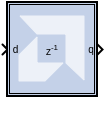

# Vector Delay

The Vector Delay block supports delay operation on vector type inputs.

Hardware notes: A delay line is a chain, each link of which is an SRL16
followed by a flip-flop.

## Description

Super Sample Rate (SSR): This configurable GUI parameter is primarily
used to control processing of multiple data samples on every sample
period. This block enables 1-D vector support for the primary block
operation.

The Vector Delay block implements a fixed delay of L cycles.

The delay value is displayed on the block in the form z^(-L), which is
the Z-transform of the block’s transfer function. Any data provided to
the input of the block will appear at the output after L cycles. The
rate and type of the data of the output is inherited from the input.
This block is used mainly for matching pipeline delays in other portions
of the circuit. The delay block differs from the register block in that
the register allows a latency of only 1 cycle and contains an initial
value parameter. The Vector Delay block supports a specified latency,
but no initial value other than zeros. The figure below shows the Vector
Delay block behavior when L=4 and Period=1s.

  
  

For delays that need to be adjusted during run-time, you should use the
Addressable Shift Register block. Delays that are not an integer number
of clock cycles are not supported and such delays should not be used in
synchronous design (with a few rare exceptions).

## Parameters

### Basic tab  
Parameters specific to the Basic tab are as follows:
#### Optional Ports  
##### Provide synchronous reset port  
Activates an optional reset (rst) pin on the block. When the reset
signal is asserted the block goes back to its initial state. Reset
signal has precedence over the optional enable signal available on the
block. The reset signal has to run at a multiple of the block's sample
rate. The signal driving the reset port must be Boolean.

##### Provide enable port  
Activates an optional enable (en) pin on the block. When the enable
signal is not asserted the block holds its current state until the
enable signal is asserted again or the reset signal is asserted. Reset
signal has precedence over the enable signal. The enable signal has to
run at a multiple of the block 's sample rate. The signal driving the
enable port must be Boolean.

##### Latency  
Latency is the number of cycles of delay. The latency can be zero,
provided that the Provide enable port check box is not checked. The
latency must be a non-negative integer. If the latency is zero, the
Vector Delay block collapses to a wire during logic synthesis. If the
latency is set to L=1, the block will generally be synthesized as a
flip-flop (or multiple flip-flops if the data width is greater than 1).

### Implementation tab  
Parameters specific to the Implementation tab are as follows:

#### Implement using behavioral HDL: 
Uses behavioral HDL as the implementation. This allows the downstream logic synthesis tool to
  choose the best implementation.

Other parameters used by this block are explained in the topic [Common
Options in Block Parameter Dialog
Boxes](matlab:helpview(vmcHelp('name','common-options'))).

## Logic Synthesis using Behavioral HDL

This setting is recommended if you are using Synplify Pro as the
downstream logic synthesis tool. The logic synthesis tool will implement
the delay as it desires, performing optimizations such as moving parts
of the delay line back or forward into blockRAMs, DSP48s, or embedded
IOB flip-flops; employing the dedicated SRL cascade outputs for long
delay lines based on the architecture selected; and using flip-flops to
terminate either or both ends of the delay line based on path delays.
Using this setting also allows the logic synthesis tool, if
sophisticated enough, to perform retiming by moving portions of the
delay line back into combinational logic clouds.

## Logic Synthesis using Structural HDL

If you do not check the Implement using behavioral HDL box, then
structural HDL is used. This is the default setting and results in a
known, but less-flexible, implementation which is often better for use
with Vivado® synthesis. In general, this setting produces structural HDL
comprising an SRL (Shift-Register LUT) delay of (L-1) cycles followed by
a flip-flop, with the SRL and the flip-flop getting packed into the same
slice. For a latency greater than L=33, multiple SRL/flip-flop sets are
cascaded, albeit without using the dedicated cascade routes. For
example, the following is the synthesis result for a 1-bit wide Vector
Delay block with a latency of L=64.
