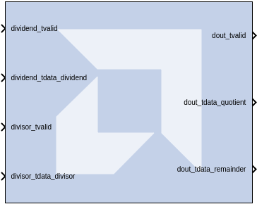

# Divider Generator 5.1

## Description
The Divider Generator block creates a circuit for integer
division based on Radix-2 non-restoring division, or High-Radix division
with prescaling.

## Block Parameters

### Basic tab  
#### Common Options  
##### Algorithm Type  
* **Radix-2**: Non-restoring integer division using integer operands, allows
  a remainder to be generated. This is recommended for operand widths
  less than around 16 bits. This option supports both unsigned and
  signed (2’s complement) divisor and dividend inputs.
* **High_Radix**: Division with prescaling. This is recommended for operand
  widths greater than 16 bits, though the implementation requires the
  use of DSP48 (or variant) primitives. This option only supports signed
  (2’s complement) divisor and dividend inputs.
* **LutMult**: A simple lookup estimate of the reciprocal of the divisor
  followed by a multiplier. Only the remainder output type is supported
  because of the bias required in the reciprocal estimate. This bias
  would introduce an offset (error) if used to create a fractional
  output. This is recommened for operand widths less than or equal to 12
  bits. This implementation uses DSP slices, block RAM, and a small
  number of FPGA logic primitives (registers and LUTs). For operand
  widths where either Radix2 or the LUTMult options are possible, the
  LUTMult offers a solution using fewer FPGA logic resources because of
  the use of DSP and block RAM primitives. Supports unsigned or two's
  complement signed numbers.

#### Output channel  
##### Remainder type  
###### Remainder  
Only supported for Radix 2.

###### Fractional  
Determines the number of bits in the fractional port output.

##### Fractional width  
If Fractional Remainder type is selected, this entry determines the
number of bits in the fractional port output.

#### Radix2 Options  
##### Radix2 throughput  
Determines the interval in clocks between new data being input (and
output). Choices are 1, 2, 4, and 8.

#### High Radix Options  
##### Detect divide by zero  
Determines if the core shall have a division-by-zero indication output
port.

#### AXI Interface  
##### AXI behavior  
###### NonBlocking  
Performs an action only when a control packet and a data packet are
presented to the block at the same time.

###### Blocking  
Preforms an action when a data packet is presented to the block. The
block uses the previous control information.

##### AXI Implementation emphasis  
###### Resources  
Automatic (fully pipelined) or Manual (determined by following field).

###### Performance  
Implementation decisions target the highest speed.

#### Latency Options  
##### Latency configuration  
Automatic (fully pipelined) or Manual (determined by following field).

##### Latency  
This field determines the exact latency from input to output in terms of
clock enabled clock cycles.

### Optional ports tab  
#### Optional Ports  
##### Divided Channel Ports  
###### Has TUSER  
Adds a tuser input port to the dividend channel.

###### Has TLAST  
Adds a tlast output port to the dividend channel.

##### Divisor Channel Ports  
###### Has TUSER  
Adds a tuser input port to the divisor channel.

###### Has TLAST  
Adds a tlast output port to the divisor channel.

##### ACLKEN  
Specifies that the block has a clock enable port (the equivalent of
selecting the Has ACLKEN option in the CORE Generator GUI).

##### ARESETn  
Specifies that the block has a reset port. Active-Low synchronous clear.
A minimum ARESETn pulse of two cycles is required.

##### m_axis_dout_tready  
Specifies that the block has a dout_tready output port.

#### Input TLAST combination for output  
Determines the behavior of the dout_tlast output port.

##### Null  
Output is null.

##### Pass_Dividend_TLAST  
Pass the value of the dividend_tlast input port to the dout_tlast output
port.

##### Pass Divisor_TLAST  
Pass the value of the divisor_tlast input port to the dout_tlast output
port.

##### OR_all_TLASTS  
Pass the logical OR of all the present TLAST input ports.

##### AND_all_TLASTS  
Pass the logical AND of all the present TLAST input ports.

Other parameters used by this block are explained in the topic [Common
Options in Block Parameter Dialog
Boxes](matlab:helpview(vmcHelp('name','common-options'))).

## LogiCORE™ Documentation

Divider Generator LogiCORE IP Product Guide
([PG151](https://docs.xilinx.com/access/sources/ud/document?isLatest=true&url=pg151-div-gen&ft:locale=en-US))
