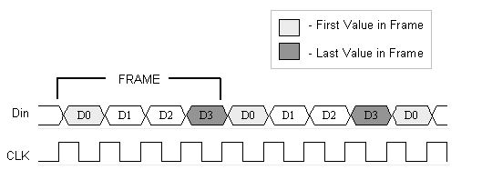

# Vector Down Sample

The Vector Down Sample block down samples input vector data.

Hardware notes: Sample and Latency controls determine the hardware
implementation. The cost in hardware of different implementations varies
considerably.

## Description

Super Sample Rate (SSR): This configurable GUI parameter is primarily
used to control processing of multiple data samples on every sample
period. This blocks enable 1-D vector support for the primary block
operation.

The Vector Down Sample block reduces the sample rate at the point where
the block is placed in your design.

The input signal is sampled at even intervals, at either the beginning
(first value), or end (last value) of a frame. The sampled value is
presented on the output port and held until the next sample is taken.

A Vector Down Sample frame consists of l input samples, where l is
sampling rate. An example frame for a Vector Down Sample block
configured with a sampling rate of 4 is shown below.

Figure: Vector Down Sample with Sampling Rate of 4

  
  

The Vector Down Sample block is realized in hardware using one of three
possible implementations that vary in terms of implementation
efficiency. The block receives two clock enable signals in hardware,
`Src_CE`, and `Dest_CE`. `Src_CE` is the faster clock enable signal and
corresponds to the input data stream rate. `Dest_CE` is the slower clock
enable, corresponding to the output stream rate, for example, down
sampled data. These enable signals control the register sampling in
hardware.

## Zero Latency Vector Down Sample

The zero latency Vector Down Sample block must be configured to sample
the first value of the frame. The first sample in the input frame passes
through the mux to the output port. A register samples this value during
the first sample duration and the mux switches to the register output at
the start of the second sample of the frame. The result is that the
first sample in a frame is present on the output port for the entire
frame duration. This is the least efficient hardware implementation as
the mux introduces a combinational path from Din to Dout. A single bit
register adjusts the timing of the destination clock enable, so that it
is asserted at the start of the sample period, instead of the end. The
hardware implementation is shown below.

Figure: Zero Latency Vector Down Sample

  
  

## Vector Down Sample with Latency

If the Vector Down Sample block is configured with latency greater than
zero, a more efficient implementation is used. One of two
implementations is selected depending on whether the Vector Down Sample
block is set to sample the first or last value in a frame.

If the block samples the first value in a frame, two registers are
required to correctly sample the input stream. The first register is
enabled by the adjusted clock enable signal so that it samples the input
at the start of the input frame. The second register samples the
contents of the first register at the end of the sample period to ensure
output data is aligned correctly.

Figure: Two Register Example

  
  

If the block samples the last value in a frame, a register samples the
data input data at the end of the frame. The sampled value is presented
for the duration of the next frame. The most efficient implementation is
used when the Vector Down Sample block is configured to sample the last
value of the frame.

Figure: One Register Example

  
  

## Block Parameters

The Block Parameters dialog box can be invoked by double-clicking the
icon in your Simulink® model.

Basic tab  
Basic tab parameters are as follows.

Sampling Rate (number of input samples per output sample)  
Must be an integer greater or equal to 2. This is the ratio of the
output sample period to the input, and is essentially a sample rate
divider. For example, a ratio of 2 indicates a 2:1 division of the input
sample rate. If a non-integer ratio is desired, the Vector Up Sample
block can be used in combination with the Vector Down Sample block.

Sample  
The Vector Down Sample block can sample either the first or last value
of a frame. This parameter will determine which of these two values is
sampled.

Other parameters used by this block are explained in the topic [Common
Options in Block Parameter Dialog
Boxes](common-options-in-block-parameter-dialog-boxes-aa1032308.html).

## Xilinx LogiCORE

The Vector Down Sample block does not use a Xilinx® LogiCORE™™.
