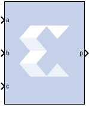

# DSP Macro 1.0

The DSP macro block provides a device independent abstraction of
the DSP48E1, DSP48E2, and DSP58 blocks. Using this block instead of
using a technology-specific DSP slice helps makes the design more
portable between technologies.

## Description

The DSP Macro provides a simplified interface to the XtremeDSP slice by
the abstraction of all opmode, subtract, alumode, and inmode controls to
a single SEL port. Further, all CE and RST controls are grouped to a
single CE and SCLR port respectively. This abstraction enhances
portability of HDL between device families.

You can specify 1 to 64 instructions which are translated into the
various control signals for the XtremeDSP slice of the target device.
The instructions are stored in a ROM from which the appropriate
instruction is selected using the SEL port.

## Parameters

### Instruction tab  
The Instruction tab is used to define the operations that the LogiCORE™
is to implement. Each instruction can be entered on a new line, or in a
comma delimited list, and are enumerated from the top down. You can
specify a maximum of 64 instructions.

Refer to the topic Instructions page of the DSP Macro LogiCORE IP
Product Guide (PG323) for details on all the parameters on this tab.

### Pipeline Options tab  
The Pipeline Options tab is used to define the pipeline depth of the
various input paths.

#### Pipeline Options  
Specifies the pipeline method to be used; Automatic, By Tier, or Expert.

#### Custom Pipeline options  
Used to specify the pipeline depth of the various input paths.

#### Tier 1 to 6  
When By Tier is selected for Pipeline Options these parameters are used
to enable/disable the registers across all the input paths for a given
pipeline stage. The following restrictions are enforced:

- When P has been specified in an expression tier, 6 will be forced as
  asynchronous feedback is not supported.

#### Individual registers  
When you select Expert for the Pipeline Options, these parameters are
used to enable/disable individual register stages. The following
restrictions are enforced:

- The P register is forced when P is specified in an expression.
  Asynchronous feedback is not supported.

Refer to the topic Detailed Pipeline Implementation of the DSP Macro
LogiCORE IP Product Guide (PG323) for details on all the parameters on
this tab.

### Implementation tab  
The Implementation tab is used to define implementation options.

#### Output Port Properties  
##### Precision  
Specifies the precision of the P output port.

###### Full  
The bit width of the output port P is set to the full XtremeDSP Slide
width of 48 bits.

###### User_Defined  
The output width of P can be set to any value up to 48 bits. When set to
less than 48 bits, the output is truncated (LSBs removed).

##### Width  
Specifies the User Defined output width of the P output port

##### Binary Point  
  Specifies the placement of the binary point of the P output port.

#### Additional ports  
##### Use ACOUT  
Use the optional cascade A output port.

##### Use CARRYOUT  
Use the optional carryout output port.

##### Use BCOUT  
Use the optional cascade B output port.

##### Use CARRYCASCOUT  
  Use the optional cascade carryout output port.

##### Use PCOUT  
  Use the optional cascade P output port.

#### Control ports  
Refer to the topic Implementation Page of the DSP Macro LogiCORE IP
Product Guide (PG323) for details on all the parameters on this tab.

## LogiCORE Documentation

DSP Macro LogiCORE IP Product Guide (PG323)
