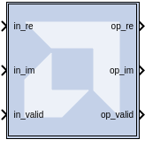

# Vector FFT Float

The Vector FFT Float block supports the FFT operation for vector 
single-precision floating-point inputs. This block only supports Versal devices.

## Description

The real part of the input data should be given to the in_re port, 
and the imaginary part should be given to the in_im port.

When the in_valid is high, it indicates that the input data is valid. 
When out_valid is high, it indicates that the output data is valid. 
The valid indicator accompanies every set of input and output samples 
(for example, R number of samples). There is no back pressure flow control 
and once an FFT transform starts, R data samples must be input into the 
core every clock for N/R consecutive clocks, where N is the FFT length. 
However, for back-to-back transforms, the valid control input can stay 
high with no gaps.

### Data Type Support

- in_valid and out_valid are of Boolean data type.

## Parameters

#### FFT length (N) 
N is the size of the transformation, and should be powers
of 2 in the range of 2^3 to 2^16. 

#### SSR (R)
R is the super sample rate, the
number of samples processed in parallel every clock. Using a typical
example with N=1024 and SSR=4, the core would compute one 1K FFT every
256 clock cycles, processing 4 input samples/clock. 

The SSR is limited to 2 and 4.

#### Block RAM_THRESHOLD 
Is an implementation parameter with no functional implications. It controls 
the use of distributed RAM vs BRAM when implementing delay lines. It can 
be used to trade utilization numbers between these two types of resources. 
The higher the value, the more distributed RAM will be used instead of 
BRAM. Typical values to try are 258, 514, and 1026.

--------------
Copyright (C) 2024 Advanced Micro Devices, Inc.
All rights reserved.
