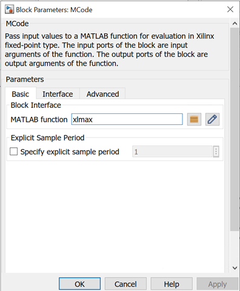
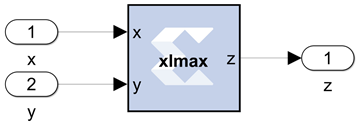
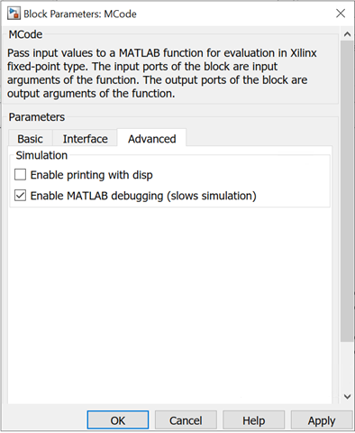
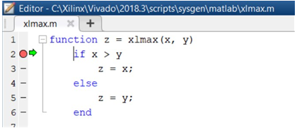
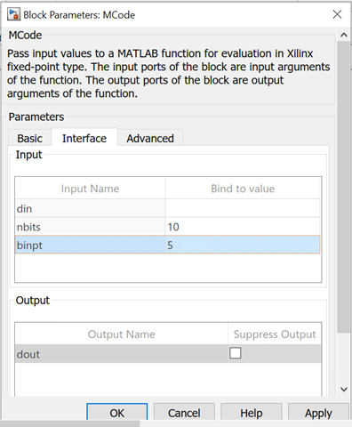
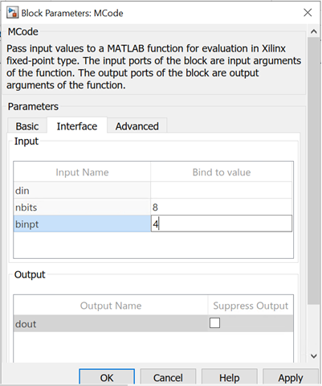
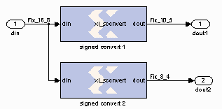
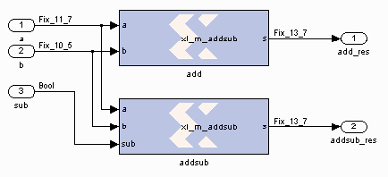

# MCode

The MCode block is a container for executing a user-supplied
MATLAB function within Simulink®. A parameter on the block specifies the
M-function name. The block executes the M-code to calculate block
outputs during a Simulink simulation. The same code is translated in a
straightforward way into equivalent behavioral VHDL/Verilog when
hardware is generated.


## Description
The block's Simulink interface is derived from the MATLAB function
signature, and from block mask parameters. There is one input port for
each parameter to the function, and one output port for each value the
function returns. Port names and ordering correspond to the names and
ordering of parameters and return values.

The MCode block supports a limited subset of the MATLAB language that is
useful for implementing arithmetic functions, finite state machines, and
control logic.

The MCode block has the following three primary coding guidelines that
must be followed:

- All block inputs and outputs must be of Xilinx fixed-point type.
- The block must have at least one output port.
- The code for the block must exist on the MATLAB path or in the same
  directory as the directory as the model that uses the block.

The example described below consists of a function xlmax which returns
the maximum of its inputs. The second illustrates how to do simple
arithmetic. The third shows how to build a finite state machine.

## Configuring an MCode Block

The MATLAB Function parameter of an MCode block specifies the name of
the block's M- code function. This function must exist in one of the
three locations at the time this parameter is set. The three possible
locations are:

- The directory where the model file is located.
- A subdirectory of the model directory named private.
- A directory in the MATLAB path.

The block icon displays the name of the M-function. To illustrate these
ideas, consider the file xlmax.m containing function xlmax:

``` pre
function z = xlmax(x, y) 
  if x > y 
    z = x; 
  else 
  z = y; 
  end 
```

An MCode block based on the function xlmax will have input ports x
and y and output port z.

The following figure shows how to set up an MCode block to use function
xlmax.




Once the model is compiled, the xlmax MCode block will appear like the
block illustrated below.




### MATLAB Language Support

The MCode block supports the following MATLAB language constructs:

- Assignment statements
- Simple and compound if/else/elseif end statements
- switch statements
- Arithmetic expressions involving only addition and subtraction
- Addition
- Subtraction
- Multiplication
- Division by a power of two
- Relational operators:
  |     |                          |
  |-----|--------------------------|
  | \<  | Less than                |
  | \<= | Less than or equal to    |
  | \>  | Greater than             |
  | \>= | Greater than or equal to |
  | ==  | Equal to                 |
  | ~=  | Not equal to             |
- Logical operators:
  |      |     |
  |------|-----|
  | `& ` | And |
  | `| ` | Or  |
  | `~ ` | Not |

The MCode block supports the following MATLAB functions.

- Type conversion. The only supported data type is xfix, the Xilinx
  fixed-point type. The xfix() type conversion function is used to
  convert to this type. The conversion is done implicitly for integers
  but must be done explicitly for floating point constants. All values
  must be scalar; arrays are not supported.
- Functions that return xfix properties:
  |               |                               |
  |---------------|-------------------------------|
  | `xl_nbits() ` | Returns number of bits        |
  | `xl_binpt() ` | Returns binary point position |
  | `xl_arith() ` | Returns arithmetic type       |
- Bit-wise logical functions:
  |             |              |
  |-------------|--------------|
  | `xl_and() ` | Bit-wise and |
  | `xl_or() `  | Bit-wise or  |
  | `xl_xor() ` | Bit-wise xor |
  | `xl_not() ` | Bit-wise not |
- Shift functions: `xl_lsh()` and `xl_rsh() `
- Slice function: `xl_slice() `
- Concatenate function: `xl_concat() `
- Reinterpret function: `xl_force() `
- Internal state variables: `xl_state() `
- MATLAB Functions:
  |               |                                     |
  |---------------|-------------------------------------|
  | `disp() `     | Displays variable values            |
  | `error() `    | Displays message and abort function |
  | `isnan() `    | Tests whether a number is NaN       |
  | `NaN() `      | Returns Not-a-Number                |
  | `num2str() `  | Converts a number to string         |
  | `ones(1,N) `  | Returns 1-by-N vector of ones       |
  | `pi() `       | Returns pi                          |
  | `zeros(1,N) ` | Returns 1-by-N vector of zeros      |

#### Data Types  
There are three kinds of xfix data types: unsigned fixed-point
(xlUnsigned), signed fixed-point(xlSigned), and boolean
(xlBoolean). Arithmetic operations on these data types produce signed
and unsigned fixed-point values. Relational operators produce a boolean
result. Relational operands can be any xfix type, provided the mixture
of types makes sense. Boolean variables can be compared to boolean
variables, but not to fixed-point numbers; boolean variables are
incompatible with arithmetic operators. Logical operators can only be
applied to boolean variables. Every operation is performed in full
precision, for example, with the minimum precision needed to guarantee
that no information is lost.

#### Literal Constants  
Integer, floating-point, and boolean literals are supported. Integer
literals are automatically converted to xfix values of appropriate
width having a binary point position at zero. Floating-point literals
must be converted to the xfix type explicitly with the xfix()
conversion function. The predefined MATLAB values true and false are
automatically converted to boolean literals.

#### Assignment  
The left-hand side of an assignment can only contain one variable. A
variable can be assigned more than once.

#### Control Flow  
The conditional expression of an if statement must evaluate to a
boolean. Switch statements can contain a case clause and an
otherwise clause. The types of a switch selector and its cases must be
compatible; thus, the selector can be boolean provided its cases are.
All cases in a switch must be constant; equivalently, no case can
depend on an input value.

When the same variable is assigned in several branches of a control
statement, the types being assigned must be compatible. For example,

``` pre
if (u > v)
  x = a;
else 
  x = b; 
end
```

is acceptable only if a and b are both boolean or both arithmetic.


#### Constant Expressions  
An expression is constant provided its value does not depend on the
value of any input argument. Thus, for example, the variable c defined
by

``` pre
a = 1;
b = a + 2;
c = xfix({xlSigned, 10, 2}, b + 3.345);
```

can be used in any context that demands a constant.

##### xfix() Conversion  
The xfix() conversion function converts a double to an xfix, or
changes one xfix into another having different characteristics. A call
on the conversion function looks like the following

``` pre
x = xfix(type_spec, value)
```

Here x is the variable that receives the xfix. type_spec is a cell
array that specifies the type of xfix to create, and value is the
value being operated on. The value can be floating point or xfix
type. The type_spec cell array is defined using curly braces in the
usual MATLAB method. For example,

``` pre
xfix({xlSigned, 20, 16, xlRound, xlWrap}, 3.1415926)
```

returns an xfix approximation to pi. The approximation is signed,
occupies 20 bits (16 fractional), quantizes by rounding, and wraps on
overflow.

The type_spec consists of 1, 3, or 5 elements. Some elements can be
omitted. When elements are omitted, default element settings are used.
The elements specify the following properties (in the order presented):
data type, width, binary point position, quantization mode, and
overflow mode. The data type can be xlBoolean, xlUnsigned, or
xlSigned. When the type is xlBoolean, additional elements are not
needed (and must not be supplied). For other types, width and
binary point position must be supplied. The quantization and
overflow modes are optional, but when one is specified, the other must
be as well. Three values are possible for quantization: xlTruncate,
xlRound, and xlRoundBanker. The default is xlTruncate. Similarly,
three values are possible for overflow: xlWrap, xlSaturate, and
xlThrowOverflow. For xlThrowOverflow, if an overflow occurs during
simulation, an exception occurs.

All values in a type_spec must be known at compilation time;
equivalently, no type_spec value can depend on an input to the function.

The following is a more elaborate example of an xfix() conversion:

``` pre
width = 10, binpt = 4; 
z = xfix({xlUnsigned, width, binpt}, x + y);
```

This assignment to x is the result of converting x + y to an
unsigned fixed-point number that is 10 bits wide with 4 fractional bits
using xlTruncate for quantization and xlWrap for overflow.

If several xfix() calls need the same *type_spec* value, you can
assign the *type_spec* to a variable, then use the variable for xfix()

calls. For example, the following is allowed:

``` pre
proto = {xlSigned, 10, 4};
x = xfix(proto, a);
y = xfix(proto, b);
```


#### xfix Properties: xl_arith, xl_nbits, and xl_binpt  
Each xfix number has three properties: the arithmetic type, the bit
width, and the binary point position. The MCode blocks provide three
functions to get these properties of a fixed- point number. The results
of these functions are constants and are evaluated when Simulink
compiles the model.

Function a = xl_arith(x) returns the arithmetic type of the input
number x. The return value is either 1, 2, or 3 for
xlUnsigned, xlSigned, or xlBoolean respectively.

Function n = xl_nbits(x) returns the width of the input number x.

Function b = xl_binpt(x) returns the binary point position of the
input number x.


#### Bit-wise Operators: xl_or, xl_and, xl_xor, and xl_not  
The MCode block provides four built-in functions for bit-wise logical
operations: xl_or, xl_and, xl_xor, and xl_not.

Function xl_or, xl_and, and xl_xor perform bit-wise logical or,
and, and xor operations respectively. Each function is in the form of

``` pre
x = xl_op(a, b, ...).
```

Each function takes at least two fixed-point numbers and returns a
fixed-point number. All the input arguments are aligned at the binary
point position.

Function xl_not performs a bit-wise logical not operation. It is in
the form of x = xl_not(a). It only takes one xfix number as its
input argument and returns a fixed- point number.

The following are some examples of these function calls:

``` pre
X = xl_and(a, b);
Y = xl_or(a, b, c);
Z = xl_xor(a, b, c, d);
N = xl_not(x);
```


#### Shift Operators: xl_rsh, and xl_lsh  
Functions xl_lsh and xl_rsh allow you to shift a sequence of bits of
a fixed-point number. The function is in the form:

x = xl_lsh(a, n) and x = xl_rsh(a, n) where a is a xfix value
and n is the number of bits to shift.

Left or right shift the fixed-point number by n number of bits. The
right shift (xl_rsh) moves the fixed-point number toward the least
significant bit. The left shift (xl_lsh) function moves the
fixed-point number toward the most significant bit. Both shift functions
are a full precision shift. No bits are discarded and the precision of
the output is adjusted as needed to accommodate the shifted position of
the binary point.

Here are some examples:

``` pre
% left shift a 5 bits 
a = xfix({xlSigned, 20, 16, xlRound, xlWrap}, 3.1415926)
b = xl_rsh(a, 5); 
```

The output b is of type xlSigned with 21 bits and the binary point
located at bit 21.


#### Slice Function: xl_slice  
Function xl_slice allows you to access a sequence of bits of a
fixed-point number. The function is in the form:

``` pre
x = xl_slice(a, from_bit, to_bit).
```

Each bit of a fixed-point number is consecutively indexed from zero for
the LSB up to the MSB. For example, given an 8-bit wide number with
binary point position at zero, the LSB is indexed as 0 and the MSB is
indexed as 7. The block will throw an error if the from_bit or
to_bit arguments are out of the bit index range of the input number.
The result of the function call is an unsigned fixed-point number with
zero binary point position.

Here are some examples:

``` pre
% slice 7 bits from bit 10 to bit 4
b = xl_slice(a, 10, 4); 
% to get MSB 
c = xl_slice(a, xl_nbits(a)-1, xl_nbits(a)-1); 
```


#### Concatenate Function: xl_concat  
Function x = xl_concat(hi, mid, ..., low) concatenates two or more
fixed-point numbers to form a single fixed-point number. The first input
argument occupies the most significant bits, and the last input argument
occupies the least significant bits. The output is an unsigned
fixed-point number with binary point position at zero.


#### Reinterpret Function: xl_force  
Function x = xl_force(a, arith, binpt) forces the output to a new type
with arith as its new arithmetic type and binpt as its new binary
point position. The arith argument can be one of xlUnsigned,
xlSigned, or xlBoolean. The binpt argument must be from 0 to the
bit width inclusively. Otherwise, the block will throw an error.


#### State Variables: xl_state  

An MCode block can have internal state variables that hold their values
from one simulation step to the next. A state variable is declared with
the MATLAB keyword persistent and must be initially assigned with an
xl_state function call.

The following code models a 4-bit accumulator:

``` pre
function q = accum(din, rst)
  init = 0;

  persistent s, s = xl_state(init, {xlSigned, 4, 0});
  q = s;
  if rst
    s = init;
 else
    s = s + din;
 end
```

The state variable s is declared as persistent, and the first
assignment to s is the result of the xl_state invocation. The
xl_state function takes two arguments. The first is the initial value
and must be a constant. The second is the precision of the state
variable. It can be a type cell array as described in the xfix
function call. It can also be an xfix number. In the above code, if
s = xl_state(init, din), then state variable s will use din as the
precision. The xl_state function must be assigned to a persistent
variable.

The xl_state function behaves in the following way:

1.  In the first cycle of simulation, the xl_state function
    initializes the state variable with the specified precision.
2.  In the following cycles of simulation, the xl_state function
    retrieves the state value left from the last clock cycle and assigns
    the value to the corresponding variable with the specified
    precision.

v = xl_state(init, precision) returns the value of a state variable.
The first input argument init is the initial value, the second
argument precision is the precision for this state variable. The
argument precision can be a cell arrary in the form of
{type, nbits, binpt} or {type, nbits, binpt, quantization,overflow}.
The precision argument can also be an xfix number.

v = xl_state(init, precision, maxlen) returns a vector object. The
vector is initialized with init and will have maxlen for the maximum
length it can be. The vector is initialized with init. For example,
v = xl_state(zeros(1, 8), prec, 8) creates a vector of 8 zeros,
v = xl_state([], prec, 8) creates an empty vector with 8 as maximum
length, v = xl_state(0, prec, 8) creates a vector of one zero as
content and with 8 as the maximum length.

Conceptually, a vector state variable is a double ended queue. It has
two ends, the front which is the element at address 0 and the back which
is the element at length – 1.

Methods available for vector are:

|                                |                                                                                                                                                                                      |
|--------------------------------|--------------------------------------------------------------------------------------------------------------------------------------------------------------------------------------|
| `val = v(idx); `               | Returns the value of element at address idx.                                                                                                                                         |
| `v(idx) = val; `               | Assigns the element at address idx with val.                                                                                                                                         |
| `f = v.front; `                | Returns the value of the front end. An error is thrown if the vector is empty.                                                                                                       |
| `v.push_front(val); `          | Pushes val to the front and then increases the vector length by 1. An error is thrown if the vector is full.                                                                         |
| `v.pop_front; `                | Pops one element from the front and decreases the vector length by 1. An error is thrown if the vector is empty.                                                                     |
| `b = v.back; `                 | Returns the value of the back end. An error is thrown if the vector is empty.                                                                                                        |
| `v.push_back(val); `           | Pushes val to the back and the increases the vector length by 1. An error is thrown if the vector is full.                                                                           |
| `v.pop_back; `                 | Pops one element from the back and decreases the vector length by 1. An error is thrown if the vector is empty.                                                                      |
| `v.push_front_pop_back(val); ` | Pushes val to the front and pops one element out from the back. It's a shift operation. The length of the vector is unchanged. The vector cannot be empty to perform this operation. |
| `full = v.full; `              | Returns `true` if the vector is full, otherwise, `false`.                                                                                                                            |
| `empty = v.empty; `            | Returns `true` if the vector is empty, otherwise, `false`.                                                                                                                           |
| `len = v.length; `             | Returns the number of elements in the vector.                                                                                                                                        |

A method of a vector that queries a state variable is called a query
method. It has a return value. The following methods are query method:
v(idx), v.front, v.back, v.full, v.empty, v.length,
v.maxlen. A method of a vector that changes a state variable is called
an update method. An update method does not return any value. The
following methods are update methods: v(idx) = val,
v.push_front(val), v.pop_front, v.push_back(val), v.pop_back,
and v.push_front_pop_back(val). All query methods of a vector must be
invoked before any update method is invocation during any simulation
cycle. An error is thrown during model compilation if this rule is
broken.

The MCode block can map a vector state variable into a vector of
registers, a delay line, an addressable shift register, a single port
ROM, or a single port RAM based on the usage of the state variable. The
xl_state function can also be used to convert a MATLAB 1-D array into
a zero-indexed constant array. If the MCode block cannot map a vector
state variable into an FPGA, an error message is issued during model
netlist time. The following are examples of using vector state
variables.

### Delay Line

The state variable in the following function is mapped into a delay
line.

``` pre
function q = delay(d, lat)
  persistent r, r = xl_state(zeros(1, lat), d, lat);
  q = r.back;
  r.push_front_pop_back(d);
```

### Line of Registers

The state variable in the following function is mapped into a line of
registers.

``` pre
function s = sum4(d)
  persistent r, r = xl_state(zeros(1, 4), d);
  S = r(0) + r(1) + r(2) + r(3);
  r.push_front_pop_back(d);
```

### Vector of Constants

The state variable in the following function is mapped into a vector of
constants.

``` pre
function s = myadd(a, b, c, d, nbits, binpt)
  p = {xlSigned, nbits, binpt, xlRound, xlSaturate};
  persistent coef, coef = xl_state([3, 7, 3.5, 6.7], p);
  s = a*coef(0) + b*coef(1) + c*coef(2) + c*coef(3);
```

### Addressable Shift Register

The state variable in the following function is mapped into an
addressable shift register.

``` pre
function q = addrsr(d, addr, en, depth)
  persistent r, r = xl_state(zeros(1, depth), d);
  q = r(addr);
  if en
 r.push_front_pop_back(d);
  end
```

## Single Port ROM

The state variable in the following function is mapped into a single
port ROM.

``` pre
function q = addrsr(contents, addr, arith, nbits, binpt)
  proto = {arith, nbits, binpt};
  persistent mem, mem = xl_state(contents, proto);
  q = mem(addr);
```

### Single Port RAM  
The state variable in the following function is mapped to a single port
RAM in fabric (Distributed RAM).

``` pre
function dout = ram(addr, we, din, depth, nbits, binpt)
  proto = {xlSigned, nbits, binpt};
  persistent mem, mem = xl_state(zeros(1, depth), proto);
  dout = mem(addr);
  if we
    mem(addr) = din;
  end
```

The state variable in the following function is mapped to BlockRAM as a
single port RAM.

``` pre
function dout = ram(addr, we, din, depth, nbits, binpt,ram_enable)
  proto = {xlSigned, nbits, binpt};
  persistent mem, mem = xl_state(zeros(1, depth), proto);
  persistent dout_temp, dout_temp = xl_state(0,proto);
  dout = dout_temp;
  dout_temp = mem(addr);
  if we
    mem(addr) = din;
  end
```

## MATLAB Functions

### disp()  
Displays the expression value. In order to see the printing on the
MATLAB console, the option Enable printing with disp must be checked on
the Advanced tab of the MCode block parameters dialog box. The argument
can be a string, an xfix number, or an MCode state variable. If the
argument is an xfix number, it will print the type, binary value, and
double precision value. For example, if variable x is assigned with
xfix({xlSigned, 10, 7}, 2.75), the disp(x) will print the following
line:

``` pre
type: Fix_10_7, binary: 010.1100000, double: 2.75
```

If the argument is a vector state variable, disp() will print out the
type, maximum length, current length, and the binary and double values
of all the elements. For each simulation step, when Enable printing with
disp is on and when a disp() function is invoked, a title line is
printed for the corresponding block. The title line includes the block
name, Simulink simulation time, and FPGA clock number.

The following MCode function shows several examples of using the
disp() function.

``` pre
function x = testdisp(a, b)
persistent dly, dly = xl_state(zeros(1, 8), a);
persistent rom, rom = xl_state([3, 2, 1, 0], a);
disp('Hello World!');
disp(['num2str(dly) is ', num2str(dly)]);
disp('disp(dly) is ');
disp(dly);
disp('disp(rom) is ');
disp(rom);
a2 = dly.back;
dly.push_front_pop_back(a);
x = a + b;
disp(['a = ', num2str(a), ', ', ...
'b = ', num2str(b), ', ', ...
'x = ', num2str(x)]);
disp(num2str(true));
disp('disp(10) is');
disp(10);
disp('disp(-10) is');
disp(-10);
disp('disp(a) is ');
disp(a);
disp('disp(a == b)');
disp(a==b);
```

The following lines are the result for the first simulation step.

``` pre
xlmcode_testdisp/MCode (Simulink time: 0.000000, FPGA clock: 0)
Hello World!
num2str(dly) is [0.000000, 0.000000, 0.000000, 0.000000, 0.000000, 0.000000, 
0.000000, 0.000000]
disp(dly) is 
type: Fix_11_7,
maxlen: 8,
length: 8,
0: binary 0000.0000000, double 0.000000,
1: binary 0000.0000000, double 0.000000,
2: binary 0000.0000000, double 0.000000,
3: binary 0000.0000000, double 0.000000,
4: binary 0000.0000000, double 0.000000,
5: binary 0000.0000000, double 0.000000,
6: binary 0000.0000000, double 0.000000,
7: binary 0000.0000000, double 0.000000,
disp(rom) is 
type: Fix_11_7,
maxlen: 4,
length: 4,
0: binary 0011.0000000, double 3.0, 
1: binary 0010.0000000, double 2.0, 
2: binary 0001.0000000, double 1.0, 
3: binary 0000.0000000, double 0.0, 
a = 0.000000, b = 0.000000, x = 0.000000
1
disp(10) is
type: UFix_4_0, binary: 1010, double: 10.0
disp(-10) is
type: Fix_5_0, binary: 10110, double: -10.0
disp(a) is 
type: Fix_11_7, binary: 0000.0000000, double: 0.000000
disp(a == b)
type: Bool, binary: 1, double: 1
```

### error()  
Displays message and abort function. See MATLAB help on this function
for more detailed information. Message formatting is not supported by
the MCode block. For example:

``` pre
if latency <=0
  error('latency must be a positive');
end
```

### isnan()  
Returns true for Not-a-Number. isnan(X) returns true when X is
Not-a-Number. X must be a scalar value of double or Xilinx fixed-point
number. This function is not supported for vectors or matrices. For
example:

``` pre
if isnan(incr) & incr == 1
  cnt = cnt + 1;
end
```

### NaN()  
The NaN() function generates an IEEE arithmetic representation for
Not-a-Number. A NaN is obtained as a result of mathematically undefined
operations like 0.0/0.0 and inf-inf. NaN(1,N) generates a 1-by-N vector
of NaN values. Here are examples of using NaN.

``` pre
if x < 0
  z = NaN;
else
  z = x + y;
end
```

### num2Str()  
Converts a number to a string. num2str(X) converts the X into a
string. X can be a scalar value of double, a Xilinx fixed-point
number, or a vector state variable. The default number of digits is
based on the magnitude of the elements of X. Here's an example of
num2str:

``` pre
if opcode <=0 | opcode >= 10
  error(['opcode is out of range: ', num2str(opcode)]);
end
```

### ones()  
The ones() function generates a specified number of one values.
ones(1,N) generates a 1-by-N vector of ones. ones(M,N) where M
must be 1. It's usually used with xl_state() function call. For
example, the following line creates a 1-by-4 vector state variable
initialized to \[1, 1, 1, 1\].

``` pre
persitent m, m = xl_state(ones(1, 4), proto)
```

### zeros()  
The zeros() function generates a specified number of zero values.
zeros(1,N) generates a 1-by-N vector of zeros. zero(M,N) where M
must be 1. It's usually used with xl_state() function call. For
example, the following line creates a 1-by-4 vector state variable
initialized to \[0, 0, 0, 0\].

``` pre
persitent m, m = xl_state(zeros(1, 4), proto)
```


### FOR Loop  
FOR statement is fully unrolled. The following function sums n
samples.

``` pre
function q = sum(din, n)
  persistent regs, regs = xl_state(zeros(1, 4), din);
  q = reg(0);
  for i = 1:n-1
    q = q + reg(i);
  end
  regs.push_front_pop_back(din);
```

The following function does a bit reverse.

``` pre
function q = bitreverse(d)
  q = xl_slice(d, 0, 0);
  for i = 1:xl_nbits(d)-1
    q = xl_concat(q, xl_slice(d, i, i));
  end
```


### Variable Availability  
MATLAB code is sequential (for example, statements are executed in
order). The MCode block requires that every possible execution path
assigns a value to a variable before it is used (except as a left-hand
side of an assignment). When this is the case, the variable is available
for use. The MCode block will throw an error if its M-code function
accesses unavailable variables.

Consider the following M-code:

``` pre
function [x, y, z] = test1(a, b)
  x = a;
  if a>b
    x = a + b; y = a; 
  end
  switch a
    case 0 
      z = a + b; 
    case 1 
      z = a - b;
  end
```

Here a, b, and x are available, but y and z are not. Variable
y is not available because the if statement has no else, and variable
z is not available because the switch statement has no otherwise part.

#### Debug MCode  
There are two ways to debug your MCode. One is to insert disp()
functions in your code and enable printing; the other is to use the
MATLAB debugger. For usage of the disp() function, see the disp()
section in this topic.

If you want to use the MATLAB debugger, you need to check the Enable
MATLAB debugging option on the Advanced tab of the MCode block
parameters dialog box. Then you can open your MATLAB function with the
MATLAB editor, set break points, and debug your M-function. Just be
aware that every time you modify your script, you need to execute a
clear functions command in the MATLAB console.

To start debugging your M-function, you need to first check the Enable
MATLAB debugging check box on the Advanced tab of the MCode block
parameters dialog, then click the OK or Apply button.



Now you can edit the M-file with the MATLAB editor and set break points
as needed.


During the Simulink simulation, the MATLAB debugger will stop at the
break points you set when the break points are reached.




When debugging, you can also examine the values of the variables by
typing the variable names in the MATLAB console.


  
  

There is one special case to consider when the function for an MCode
block is executed from the MATLAB debugger. A switch/case expression
inside an MCode block must be type xfix, however, executing a
switch/case expression from the MATLAB console requires that the
expression be a double or char. To facilitate execution in the
MATLAB console, a call to double() must be added. For example,
consider the following:

``` pre
switch i
  case 0
    x = 1
  case 1
    x = 2
  end
```

where i is type xfix. To run from the console this code must changed
to

``` pre
switch double(i)
  case 0
    x = 1
  case 1
    x = 2
end
```

The double() function call only has an effect when the M code is run
from the console. The MCode block ignores the double() call.


### Passing Parameters  
It is possible to use the same M-function in different MCode blocks,
passing different parameters to the M-function so that each block can
behave differently. This is achieved by binding input arguments to some
values. To bind the input arguments, select the Interface tab on the
block GUI. After you bind those arguments to some values, these
M-function arguments will not be shown as input ports of the MCode
block.

Consider for example, the following M-function:

``` pre
function dout = xl_sconvert(din, nbits, binpt)
proto = {xlSigned, nbits, binpt};
dout = xfix(proto, din);
```

The following figures shows how the bindings are set for the din input
of two separate xl_sconvert blocks.







The following figure shows the block diagram after the model is
compiled.


  
  

The parameters can only be of type double or they can be logical
numbers.


### Optional Input Ports  
The parameter passing mechanism allows the MCode block to have optional
input ports. Consider for example, the following M-function:

``` pre
function s = xl_m_addsub(a, b, sub)
  if sub
    s = a - b;
  else
    s = a + b;
  end
```

If sub is set to be false, the MCode block that uses this M-function
will have two input ports a and b and will perform full precision
addition. If it is set to an empty cell array {}, the block will have
three input ports a, b, and sub and will perform full precision
addition or subtraction based on the value of input port sub.

The following figure shows the block diagram of two blocks using the
same xl_m_addsub function, one having two input ports and one having
three input ports.


  
  


### Constructing a State Machine  
There are two ways to build a state machine using an MCode block. One
way is to specify a stateless transition function using a MATLAB
function and pair an MCode block with one or more state register blocks.
Usually the MCode block drives a register with the value representing
the next state, and the register feeds back the current state into the
MCode block. For this to work, the precision of the state output from
the MCode block must be static, that is, independent of any inputs to
the block. Occasionally you might find you need to use xfix()
conversions to force static precision. The following code illustrates
this:

``` pre
function nextstate = fsm1(currentstate, din)
  % some other code
  nextstate = currentstate;
  switch currentstate
    case 0, if din==1, nextstate = 1; end
  end
  % a xfix call should be used at the end
  nextstate = xfix({xlUnsigned, 2, 0}, nextstate);
```

Another way is to use state variables. The above function can be
re-written as follows:

``` pre
function currentstate = fsm1(din)
  persistent state, state=xl_state(0,{xlUnsigned,2,0});
  currentstate = state;
  switch double(state)
    case 0, if din==1; state = 1; end
  end
```


### Reset and Enable Signals for State Variables  
The MCode block can automatically infer register reset and enable
signals for state variables when conditional assignments to the
variables contain two or fewer branches.

For example, the following M-code infers an enable signal for
conditional assignment of persistent state variable `r1`:

``` pre
function myFn = aFn(en, a)
  persistent r1, r1 = xl_state(0, {xlUnsigned, 2, 0});
  myFn = r1;
  if en
    r1 = r1 + a
  else
    r1 = r1
  end
```

There are two branches in the conditional assignment to persistent state
variable r1. A register is used to perform the conditional assignment.
The input of the register is connected to r1 + a, the output of the
register is r1. The register's enable signal is inferred; the enable
signal is connected to en, when en is asserted. Persistent state
variable r1 is assigned to r1 + a when en evaluates to false,
the enable signal on the register is de-asserted resulting in the
assignment of r1 to r1.

The following M-code will also infer an enable signal on the register
used to perform the conditional assignment:

``` pre
function myFn = aFn(en, a)
  persistent r1, r1 = xl_state(0, {xlUnsigned, 2, 0});
  myFn = r1;
  if en
    r1 = r1 + a
  end
```

An enable is inferred instead of a reset because the conditional
assignment of persistent state variable r1 is to a non-constant value,
r1 + a.

If there were three branches in the conditional assignment of persistent
state variable r1, the enable signal would not be inferred. The
following M-code illustrates the case where there are three branches in
the conditional assignment of persistent state variable r1 and the
enable signal is not inferred:

``` pre
function myFn = aFn(en, en2, a, b)
  persistent r1, r1 = xl_state(0, {xlUnsigned, 2, 0});
  if en
    r1 = r1 + a
  elseif en2
    r1 = r1 + b
  else
    r1 = r1
  end
```

The reset signal can be inferred if a persistent state variable is
conditionally assigned to a constant; the reset is synchronous. Consider
the following M-code example which infers a reset signal for the
assignment of persistent state variable r1 to init, a constant, when
rst evaluates to true and r1 + 1 otherwise:

``` pre
function myFn = aFn(rst)
  persistent r1, r1 = xl_state(0, {xlUnsigned, 4, 0});
  myFn = r1;
  init = 7;
  if (rst)
    r1 = init
  else
    r1 = r1 + 1
  end
```

The M-code example above which infers reset can also be written as:

``` pre
function myFn = aFn(rst)
  persistent r1, r1 = xl_state(0, {xlUnsigned,4,0});
  init = 1;
  myFn = r1;
  r1 = r1 +1
  if (rst)
    r1 = init
  end
```

In both code examples above, the reset signal of the register containing
persistent state variable r1 is assigned to rst. When rst
evaluates to true, the register's reset input is asserted and the
persistent state variable is assigned to constant init. When rst
evaluates to false, the register's reset input is de-asserted and
persistent state variable r1 is assigned to r1 + 1. Again, if the
conditional assignment of a persistent state variable contains three or
more branches, a reset signal is not inferred on the persistent state
variable's register.

It is possible to infer reset and enable signals on the register of a
single persistent state variable. The following M-code example
illustrates simultaneous inference of reset and enable signals for the
persistent state variable r1:

``` pre
function myFn = aFn(rst,en)
  persistent r1, r1 = xl_state(0, {xlUnsigned, 4, 0});
  myFn = r1;
  init = 0;
  if rst
    r1 = init
  else
    if en
      r1 = r1 + 1
    end
  end
```

The reset input for the register of persistent state variable r1 is
connected to rst; when rst evaluates to true, the register's reset
input is asserted and r1 is assigned to init. The enable input of
the register is connected to en; when en evaluates to true, the
register's enable input is asserted and r1 is assigned to r1 + 1. It
is important to note that an inferred reset signal takes precedence over
an inferred enable signal regardless of the order of the conditional
assignment statements. Consider the second code example above; if both
rst and en evaluate to true, persistent state variable r1 would
be assigned to init.

Inference of reset and enable signals also works for conditional
assignment of persistent state variables using switch statements,
provided the switch statements contain two or less branches.

The MCode block performs dead code elimination and constant propagation
compiler optimizations when generating code for the FPGA. This can
result in the inference of reset and/or enable signals in conditional
assignment of persistent state variables, when one of the branches is
never executed. For this to occur, the conditional must contain two
branches that are executed after dead code is eliminated, and constant
propagation is performed.


### Inferring Registers  
Registers are inferred in hardware by using persistent variables,
however, the right coding style must be used. Consider the two code
segments in the following function:

``` pre
function [out1, out2] = persistent_test02(in1, in2) 
persistent ff1, ff1 = xl_state(0, {xlUnsigned, 2, 0});
persistent ff2, ff2 = xl_state(0, {xlUnsigned, 2, 0});
%code segment 1
out1 = ff1; %these two statements infer a register for ff1
ff1  = in1;
%code segment 2
ff2  = in2; %these two statements do NOT infer a register for ff2
out2 = ff2;
end
```

In code segment 1, the value of persistent variable ff1 is assigned to
out1. Since ff1 is persistent , it is assumed that its current value was
assigned in the previous cycle. In the next statement, the value of in1
is assigned to ff1 so it can be saved for the next cycle. This infers a
register for ff1.

In code segment 2, the value of in2 is first assigned to persistent
variable ff2, then assigned to out2. These two statements can be
completed in one cycle, so a register is not inferred. If you need to
insert delay into combinational logic, refer to the next topic.


### Pipelining Combinational Logic  
The generated FPGA bitstream for an MCode block might contain many
levels of combinational logic and hence a large critical path delay. To
allow a downstream logic synthesis tool to automatically pipeline the
combinational logic, you can add delay blocks before the MCode block
inputs or after the MCode block outputs. These delay blocks should have
the parameter Implement using behavioral HDL set, which instructs the
code generator to implement delay with synthesizable HDL. You can then
instruct the downstream logic synthesis tool to implement register
re-timing or register balancing. As an alternative approach, you can use
the vector state variables to model delays.


### Shift Operations with Multiplication and Division  
The MCode block can detect when a number is multiplied or divided by
constants that are powers of two. If detected, the MCode block will
perform a shift operation. For example, multiplying by 4 is equivalent
to left shifting 2 bits and dividing by 8 is equivalent to right
shifting 3 bits. A shift is implemented by adjusting the binary point,
expanding the xfix container as needed. For example, a Fix_8_4
number multiplied by 4 will result in a Fix_8_2 number, and a
Fix_8_4 number multiplied by 64 will result in a Fix_10_0 number.


### Using the xl_state Function with Rounding Mode  
The xl_state function call creates an xfix container for the state
variable. The container's precision is specified by the second argument
passed to the xl_state function call. If precision uses xlRound for
its rounding mode, hardware resources is added to accomplish the
rounding. If rounding the initial value is all that is required, an
xfix call to round a constant does not require additional hardware
resources. The rounded value can then be passed to the xl_state
function. For example:

``` pre
init = xfix({xlSigned,8,5,xlRound,xlWrap}, 3.14159);
persistent s, s = xl_state(init, {xlSigned, 8, 5});
```

## Parameters


As described earlier in this topic, the MATLAB function parameter on an
MCode block tells the name of the block's function, and the Interface
tab specifies a list of constant inputs and their values.

Other parameters used by this block are explained in the topic [Common
Options in Block Parameter Dialog
Boxes](../../GEN/common-options/README.md).

--------------
Copyright (C) 2024 Advanced Micro Devices, Inc.
All rights reserved.

SPDX-License-Identifier: MIT
