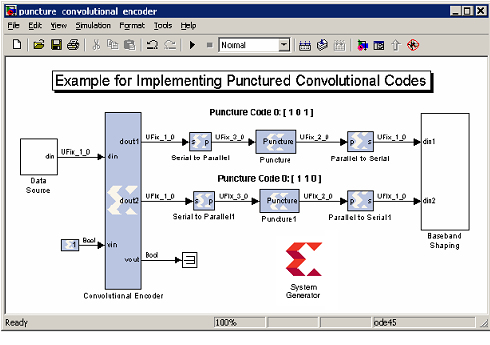

# Puncture

## Description

The Puncture block removes a set of user-specified bits from the
input words of its data stream.

Based on the Puncture Code parameter, a binary vector that specifies
which bits to remove, it converts input data of type UFixN_0 (where N
is equal to the length of the puncture code) into output data of type
UFixK_0 (where K is equal to the number of ones in the puncture code).
The output rate is identical to the input rate.

This block is commonly used in conjunction with a convolution encoder to
implement punctured convolution codes as shown in the figure below.

The system shown implements a rate ½ convolution encoder whose outputs
are punctured to produce four output bits for each three input bits. The
top puncture block removes the center bit for code 0 ( \[1 0 1\] ) and
bottom puncture block removes the least significant bit for code 1 ( \[1
1 0 \] ), producing a 2-bit punctured output. These data streams are
serialized into 1-bit in-phase and quadrature data streams for baseband
shaping.

## Block Parameters

Parameters specific to the block are as follows:

#### Puncture Code  
The puncture pattern represented as a bit vector, where a zero in
position i indicates bit i is to be removed.

Other parameters used by this block are explained in the topic [Common
Options in Block Parameter Dialog
Boxes](../../GEN/common-options/README.md).

--------------
Copyright (C) 2024 Advanced Micro Devices, Inc.
All rights reserved.

SPDX-License-Identifier: MIT
