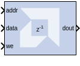
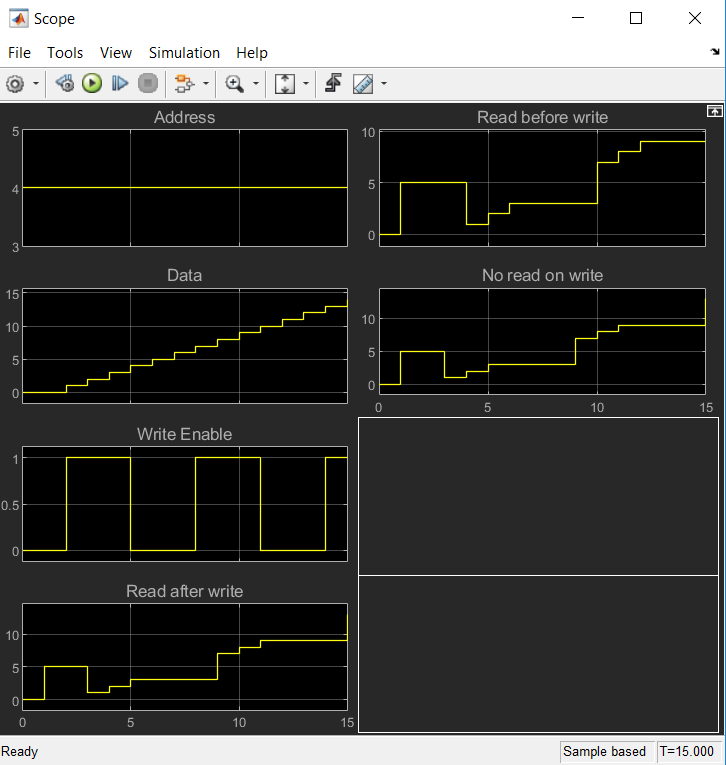

# Single Port RAM

The Xilinx Single Port RAM block implements a random access memory (RAM)
with one data input and one data output port.

## Block Interface

The block has one output port and three input ports for address, input
data, and write enable (WE). Values in a Single Port RAM are stored by
word, and all words have the same arithmetic type, width, and binary
point position.

A single-port RAM can be implemented using either block memory,
distributed memory, or UltraRAM resources in the FPGA. Each data word is
associated with exactly one address that must be an unsigned integer in
the range 0 to d-1, where d denotes the RAM depth (number of words in
the RAM). An attempt to read past the end of the memory is caught as an
error in the simulation, though if a block memory implementation is
chosen, it can be possible to read beyond the specified address range in
hardware (with unpredictable results). When the single-port RAM is
implemented in distributed memory or block RAM, the initial RAM contents
can be specified through the block parameters.

The write enable signal must be Bool, and when its value is 1, the data
input is written to the memory location indicated by the address input.
The output during a write operation depends on the choice of memory
implementation.

The behavior of the output port depends on the write mode selected (see
below). When the WE is 0, the output port has the value at the location
specified by the address line.

## Block Parameters

The Block Parameters dialog box can be invoked by double-clicking the
icon in your Simulink® model.

Basic Tab  
Parameters specific to the Basic tab are as follows.
Depth  
The number of words in the memory; must be a positive integer.

Initial value vector  
The Initial value vector stores the initial contents of the memory. When
the vector length exceeds the memory depth, values with index higher
than depth are ignored. When the depth exceeds the vector length, memory
locations with addresses higher than the vector length are initialized
to zero. Initialization values are saturated and rounded (if necessary)
according to the precision specified on the data port.

UltraRAM memory is initialized to all 0's during power up or device
reset. If implemented in UltraRAM, the Single Port RAM block cannot be
initialized to user defined values.

Memory Type  
Option to select whether the single-port RAM will be implemented using
Distributed memory, Block RAM, or UltraRAM.

Depending on your selection for Memory Type, the single-port RAM will be
inferred or implemented as follows when the design is compiled:

- If the block will be implemented in Distributed memory, the
  Distributed Memory Generator v8.0 LogiCORE IP will be inferred or
  implemented when the design is compiled. This LogiCORE IP is described
  in Distributed Memory Generator LogiCORE IP Product Guide
  ([PG063](https://www.xilinx.com/cgi-bin/docs/ipdoc?c=dist_mem_gen;v=latest;d=pg063-dist-mem-gen.pdf)).
- If the block will be implemented in block RAM or UltraRAM, the
  XPM_MEMORY_SPRAM (Single Port RAM) macro will be inferred or
  implemented when the design is compiled. For information on the
  XPM_MEMORY_SPRAM Xilinx Parameterized Macro (XPM), refer to UltraScale
  Architecture Libraries Guide
  ([UG974](https://docs.xilinx.com/access/sources/dita/map?Doc_Version=2022.2%20English&url=ug974-vivado-ultrascale-libraries)).

Write Mode  
Specifies memory behavior when WE is asserted. Supported modes are: Read
after write, Read before write, and No read On write. Read after write
indicates the output value reflects the state of the memory after the
write operation. Read before write indicates the output value reflects
the state of the memory before the write operation. No read on write
indicates that the output value remains unchanged irrespective of change
of address or state of the memory. There are device specific
restrictions on the applicability of these modes. Also refer to the
Write Modes and Hardware Notes topics below for more information.

Provide reset port for output register  
For block RAM or UltraRAM, exposes a reset port controlling the output
register of the RAM. This port does not reset the memory contents to the
initialization value.

Note: For Block RAM or UltraRAM, the reset port is available only when
the latency of the Block RAM is greater than or equal to 1.

Initial value for output register  
For Block RAM, the initial value for the output register. The initial
value is saturated and rounded as necessary according to the precision
specified on the data port of the Block RAM.

For UltraRAM, the output register is initialized to all 0's. The
UltraRAM output register cannot be initialized to user defined values.

Other parameters used by this block are explained in the [Common Options
in Block Parameter Dialog
Boxes](common-options-in-block-parameter-dialog-boxes-aa1032308.html)
topic at the beginning of this chapter.

## Write Modes

During a write operation (WE asserted), the data presented to the data
input is stored in memory at the location selected by the address input.
You can configure the behavior of the data out port A upon a write
operation to one of the following modes:

- Read after write
- Read before write
- No read on write

These modes can be described with the help of the figure shown below. In
the figure the memory has been set to an initial value of 5 and the
address bit is specified as 4. When using No read on write mode, the
output is unaffected by the address line and the output is the same as
the last output when the WE was 0. For the other two modes, the output
is obtained from the location specified by the address line, and hence
is the value of the location being written to. This means that the
output can be either the old value (Read before write mode), or the new
value (Read after write mode).

Figure: Configuration for Read After Write

Figure: Write Output

## Hardware Notes

The distributed memory LogiCORE™™ supports only the Read before write
mode. The Xilinx Single Port RAM block also allows distributed memory
with Write Mode option set to Read after write when specified latency is
greater than 0. The Read after write mode for the distributed memory is
achieved by using extra hardware resources (a MUX at the distributed
memory output to latch data during a write operation).

## LogiCORE™ and XPM Documentation

Distributed Memory Generator LogiCORE IP Product Guide
([PG063](https://www.xilinx.com/cgi-bin/docs/ipdoc?c=dist_mem_gen;v=latest;d=pg063-dist-mem-gen.pdf))
(Distributed Memory)

UltraScale Architecture Memory Resources User Guide
([UG573](https://www.xilinx.com/cgi-bin/docs/ndoc?t=user_guides;d=ug573-ultrascale-memory-resources.pdf)) -
XPM_MEMORY_SPRAM Macro (UltraRAM)
