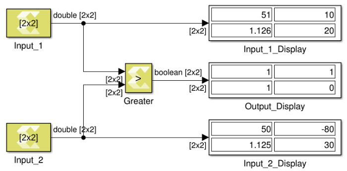

# Greater

Performs element-wise greater than relational operation on the inputs.
The top input corresponds to the first operand.

## Library

Relational Operations

## Description

The Greater block has two input signals and one output signal. The block
compares the two inputs using element-wise greater than relational
operation. The first input corresponds to the top input port and the
second input to the bottom input port. The dimension of the output
signal matches the dimensions of the input signals. An element of the
output signal is true if the corresponding element of the first input
signal is greater than the corresponding element of the second signal.
Otherwise the element is false.

## Data Type Support

Data type support for the Greater block is:

- The data types of the input signals can be integer, fixed-point,
  Boolean, or floating-point data type.
- The input signals can be a scalars, vectors, or matrices. If both
  inputs are not scalar, their dimensions must match.
- The input signals must be real.
- The output signal is Boolean.
- The dimension of the output signal is scalar if both inputs are
  scalar. Otherwise it matches the dimensions of the non-scalar input.

## Parameters

The Greater block has no parameters to set.
