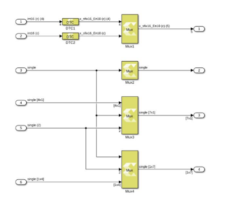

# Mux

Combines scalar and vector inputs into a larger vector output.

## Library

Signal Routing

## Description

The Mux block combines scalar and vector inputs into a larger vector.
The elements of the inputs are concatenated starting from the first
input at the top left. The block takes an input signal that is a scalar,
a vector, a row matrix, or a column matrix with the limitation that it
cannot support a row matrix signal, and a column matrix signal at the
same time. If an input is a row vector or a column vector, then the
output also takes that form. The output is a non-virtual vector meaning
that its elements are stored in contiguous memory.

The number of inputs to the block is configurable using the Number of
inputs block parameter. When the value of the block parameter is
changed, the input ports are added or removed starting from the last
port at the bottom left.

**Note**: This figure shows how the Mux block computes output port
dimensions.

## Data Type Support

Inputs  
- The number of inputs is decided by value of the Number of inputs
  parameter.
- The input signal can be a scalar, a vector (M), a row matrix (1xM), or
  column matrix (Mx1).
- The block cannot have a row matrix and a column matrix as inputs at
  the same time.
- All inputs must have the same data type, and the same numeric type
  either real or complex.
- The Mux block supports all native data types (double, single, uint8,
  int8, uint16, int16, uint32, int32, and boolean), and Model Composer
  supported half and fixed-point data types.

Outputs  
- The block has one output port.
- The output data type and numeric type are the same as the inputs.
- The output signal dimension depends upon the dimensions of the input
  signals.

## Parameters

#### Number of inputs  
The value for the parameter must be a finite positive integer. When the
value of the parameter changes, the input ports are either added or
removed starting from the last port at the bottom left.

##### 2
The block icon is initially created with two input ports.

##### N
A finite positive integer value.

The block icon is redrawn with the specified number of input ports.

--------------
Copyright (C) 2023 Advanced Micro Devices, Inc. All rights reserved.
SPDX-License-Identifier: MIT
