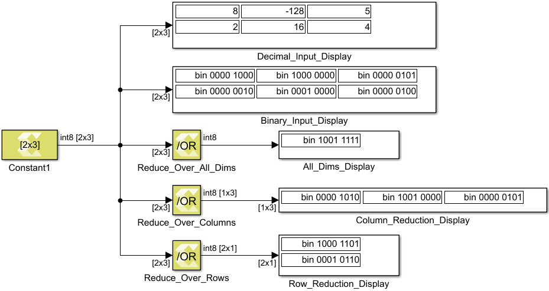

# Reduction OR

Compute bitwise OR of the elements of the input over all dimensions or
over a specified dimension

## Library

Logic and Bit Operations

## Description

The Reduction OR block has one input signal and one output signal. It
computes the bitwise OR of the elements of the input signal over all of
the dimensions or over a specified dimension. The data type of the
output signal is the same as that of the input signal. The dimension of
the output signals depends on whether the reduction takes place over all
dimensions or over a specified dimension.

Reduce over all dimensions  
The output is a scalar and it is the bitwise OR of all of the elements
of the input signal.

Reduce over dimension 1  
The output is a row vector (2-D) with as many elements as the number of
columns of the input. Each element in the output is the bitwise OR
reduction of the elements of the corresponding column of the input.

Reduce over dimension 2  
The output is a column vector (2-D) containing as many elements as the
number of rows of the input. Each element in the output is the bitwise
OR reduction of the elements of the corresponding row of the input.

In the example below a 2x3 input signal of type int8 feeds into three
different configurations of the Reduction OR block.

Figure: Reduction OR Block

## Data Type Support

- The input signal can be of any data type except for floating point
  types.
- The input signal must be real.
- The input signal must be a matrix if reduction is along dimension 2.
- The input signal can be a matrix, vector, or scalar if reduction is
  along all dimensions or along dimension 1.

## Parameters

Reduce over

This parameter specifies whether reduction takes place over all
dimensions or over a specified dimension. If reduction is specified over
all dimensions, the output signal is a scalar.

Following are settings for the Reduce over parameter.

| Setting             | Description                                                                    |
|---------------------|--------------------------------------------------------------------------------|
| All dimensions      | Reduction takes place over all dimensions.                                     |
| Specified dimension | Reduction takes place over the dimension specified by the Dimension parameter. |

Table 1. Reduce Over Parameter

Dimension

If the Reduce over parameter is set to Specified dimension, the
Dimension parameter specifies over which dimension reduction takes
place.

- If the input signal has dimensions M x N and the reduction Dimension
  is 1, the output has dimensions 1 x N.
- If the input signal has dimensions M x N and the reduction Dimension
  is 2, the output has dimensions M x 1.
- If the input signal is scalar or 1 x 1, the output dimension is 1 x 1.

Following are settings for the Dimension parameter.

| Setting | Description                   |
|---------|-------------------------------|
| 1       | Reduce over row dimension.    |
| 2       | Reduce over column dimension. |

Table 2. Dimension Parameter

Note: If the reduce Dimension is specified to be 2 the input signal must
be two-dimensional.
