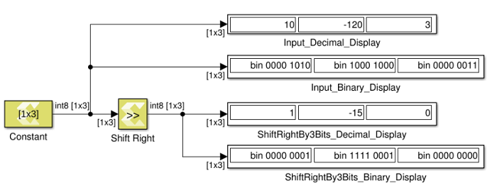

# Shift Right

Performs arithmetic shift right of input over a constant number of bit
positions specified by a non-negative integer parameter

## Library

Logic and Bit Operations

## Description

The shift right block computes an element-wise right shift of the input
by a constant amount specified via a Shift by parameter. This is also
known as arithmetic shift right. The shift amount specifies over how
many bit positions bits are shifted. This shift amount must be a
non-negative integer. The default value is 0. The output is of the same
type, dimension, and numeric type (real or complex) as the input. The
input data must be integer or fixed-point type.

## Data Type Support

The Shift Right block supports integer and fixed-point input data, but
not Boolean or floating type. Input data can be real or complex. Output
data type and dimension are the same as that of input data.

## Parameters

#### Shift by
This parameter specifies the number of bit positions over which the
shift takes place.

Enter a scalar real non-negative integer for the Shift by parameter.

--------------
Copyright (C) 2024 Advanced Micro Devices, Inc.
All rights reserved.
