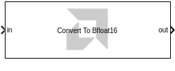
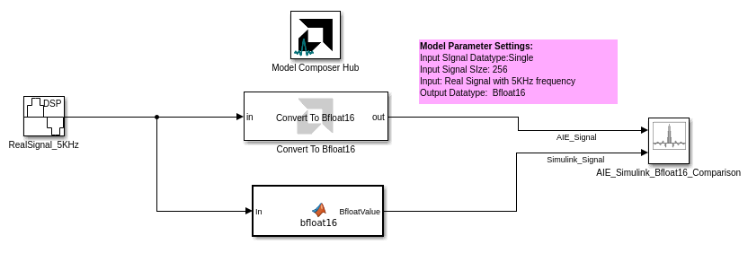
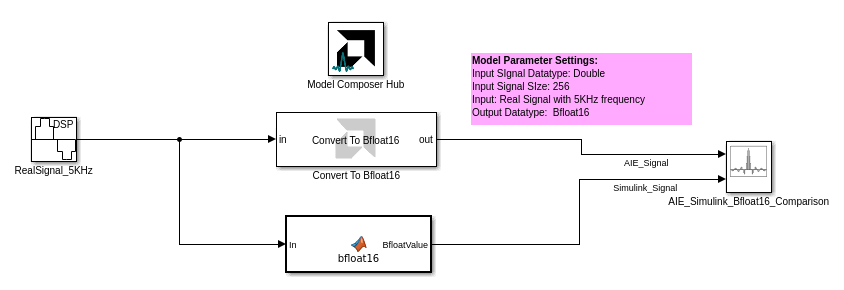

# Convert To Bfloat16
This block converts a Simulink floating point input to `bfloat16` data type for use with AI Engine blocks.
  
  

## Library

AI Engine/Tools

## Description

This block converts a Simulink floating point data type to a `bfloat16` data type for use with AI Engine blocks. The floating point input can be of type `double` or `single`.

On the Simulink canvas, the 'bfloat16' signal will have data type `x_bfloat16`. This data type is supported only by AI Engine blocks and should only be used in an AI Engine subsystem. However, the **Convert To Bfloat16** block should be placed outside the AI Engine subsystem.

This block does not support complex inputs. The output signal will have the same dimensions as the input signal.

## Examples

***Click on the images below to open each model.***

## Related blocks
[Convert_From_Bfloat16](../Convert_From_Bfloat16/README.md)

## References

`bfloat16` is a 16-bit floating point data type that is supported on AIE-ML devices. For more information on `bfloat16`, refer to [AI Engine-ML Kernel and Graph Programming Guide (UG1603)](https://docs.xilinx.com/r/en-US/ug1603-ai-engine-ml-kernel-graph/Floating-Point-Operations).

--------------
Copyright (C) 2024 Advanced Micro Devices, Inc.
All rights reserved.
