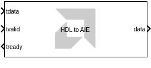

# HDL to AIE

This block is used to connect the HDL domain to the AI Engine domain
using the AXI4-Stream protocol.  

  

## Library

Utilities/Connectors

## Description

This block translates between HDL and AI Engine data types. It also determines the Simulink sample rate of the AI Engine design, based on the HDL sample rate and the relationship between the HDL/AIE data types.

The AXI4-Stream interface is required to interface an HDL subsystem with the AI Engine. AXI4-Stream interfaces have a minimum of 3 signals:

* `tdata`: The data signal.
* `tvalid`: Signal indicating the producer is producing valid data on the tdata signal.
* `tready`: Signal indicating the consumer is ready to receive data on the tdata signal.

For more information, see [How AXI4-Stream Works](https://docs.xilinx.com/r/en-US/ug1399-vitis-hls/How-AXI4-Stream-Works).

**Note:** For more information on setting this block and examples, refer to
the [Connecting AI Engine and HDL Subsystems](https://github.com/Xilinx/Vitis_Model_Composer/blob/HEAD/Tutorials/AIE-PL/AIE_HDL_tutorial) tutorial.

## Parameters

#### Input data type

Specify the data type of the `tdata` signal coming from the HDL subsystem.

#### Output data type 

Specify the data type of the `data` signal going to the AIE subsystem.

When converting input to output data types, the HDL to AIE block only splits the underlying bits of the data; it does not change their numerical values.

The following table shows the input data types that are needed to produce each output data type.

| Output Data Type | Input Data Type           |
|------------------|---------------------------|
| int8             | uint32, ufix64, ufix128   |
| uint8            | uint32, ufix64, ufix128   |
| int16            | uint32, ufix64, ufix128   |
| uint16           | uint32, ufix64, ufix128   |
| cint16           | uint32, ufix64, ufix128   |
| int32            | int32, ufix64, ufix128    |
| uint32           | uint32, ufix64, ufix128   |
| cint32           | ufix64, ufix128           |
| int64            | sfix64                    |
| uint64           | ufix64, ufix128           |
| float            | uint32, ufix64, ufix128   |
| cfloat           | ufix64, ufix128           |

#### Number of output samples  

This determines the number of samples in the output frame. This value should be set to the number of samples expected at the input of the AI Engine kernel.

#### Reduce output sample rate by a factor of

Specify a factor by which to reduce the output sample rate of the HDL to AIE block.

If the HDL subsystem does not produce valid data on every clock cycle, the AI Engine subsystem will operate at a reduced rate. The **Reduce output sample rate by a factor of** parameter allows you to model this behavior.

For example, if the HDL subsystem asserts `tvalid` every 4 HDL clock cycles, set the **Reduce output sample rate by a factor of** parameter to 4.

If you do not do this, the HDL to AIE block will output a variable-size signal that is empty when there is no valid data. For analysis and viewing the signal on a scope, it is easier to work with variable-size signals that are full. For more information, see the [Variable-Size Signals Quick Guide](https://github.com/Xilinx/Vitis_Model_Composer/HEAD/2023.2/QuickGuides/Variable_Size_Signals).

## Input and Output period
This block is a multirate block. The input period and the output period can be different depending on the setting of the parameters. The diagram below shows an example of how the output period changes based on the different settings.

 

# Examples
[An exmaple of importing RTL into Model Composer and connecting it to AIE Engine blocks](https://github.com/abehbood/Vitis_Model_Composer/tree/2023.2/Examples/AIENGINE_plus_PL/AIE_HDL/AIE_HDL_cosim_rtl_blackbox)

[Single Stream SSR FIR with PL + AIE](https://github.com/abehbood/Vitis_Model_Composer/tree/2023.2/Examples/AIENGINE_plus_PL/AIE_HDL/SingleStreamSSR_FIR_withPL)

