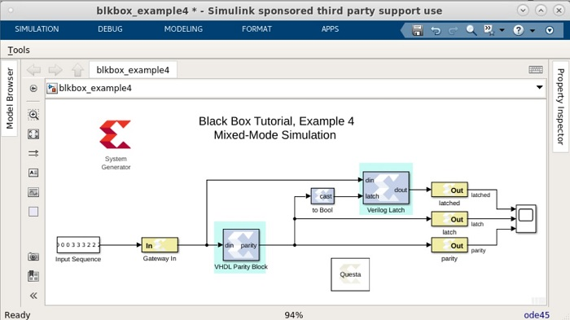
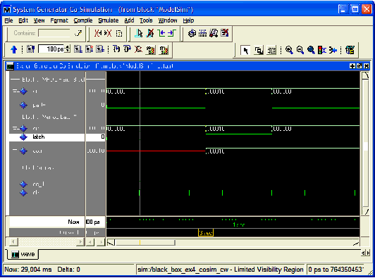
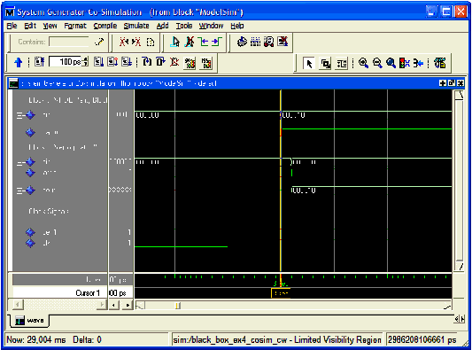
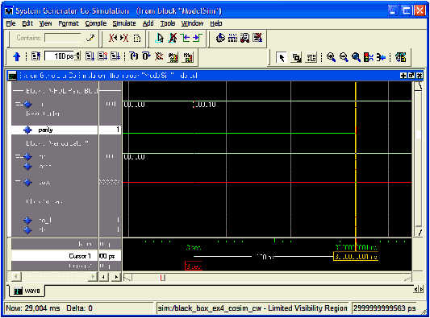

# Questa

The HDL [Black Box](blackbox.html) block provides a way to incorporate
existing HDL files into a model. When the model is simulated,
co-simulation can be used to allow black boxes to participate. The
Questa HDL co-simulation block configures and controls co-simulation for
one or several black boxes.

  
  

## Description

During a simulation, each Questa block spawns one copy of Questa, and
therefore uses one Questa license. If licenses are scarce, several black
boxes can share the same block.

In detail, the Questa block does the following:

- Constructs the additional VHDL and Verilog needed to allow black box
  HDL to be simulated inside Questa.
- Spawns a Questa session when a Simulink simulation starts.
- Mediates the communication between Simulink and Questa.
- Reports if errors are detected when black box HDL is compiled.
- Terminates Questa, if appropriate, when the simulation is complete.

Note: The Questa block only supports symbolic radix in the Questa tool.
In symbolic radix, Questa displays the actual values of an enumerated
type, and also converts an object's value to an appropriate
representation for other radix forms. Please refer to the Questa
documentation for more information on symbolic radix.

## Parameters

### Basic tab  
Parameters specific to the Basic tab are as follows:

#### Run co-simulation in directory  
Questa is started in the directory named by this field. The directory is
created if necessary. All black box files are copied into this
directory, as are the auxiliary files Model Composer produces for
co-simulation. Existing files are overwritten silently. The directory
can be specified as an absolute or relative path. Relative paths are
interpreted with respect to the directory in which the Simulink .mdl
file resides.

#### Open waveform viewer  
When this checkbox is selected, the Questa waveform window opens
automatically, displaying a standard set of signals. The signals include
all inputs and outputs of all black boxes and all clock and clock enable
signals supplied by Model Composer. The signal display can be customized
with an auxiliary tcl script. To specify the script, select Add Custom
Scripts and enter the script name (e.g., myscript.do) in the Script to
Run After vsim field.

#### Leave Questa open at end of simulation  
When this checkbox is selected, the Questa session is left open after
the Simulink simulation has finished.

#### Skip compilation (use previous results)  
When this checkbox is selected, the Questa compilation phase is skipped
in its entirety for all black boxes that are using the Questa block for
HDL co-simulation. To select this option is to assert that: (1)
underneath the directory in which Questa will run, there exists a Questa
work directory, and (2) that the work directory contains up-to-date
Questa compilation results for all black box HDL. Selecting this option
can greatly reduce the time required to start-up the simulation,
however, if it is selected when inappropriate, the simulation can fail
to run or run but produce false results.

### Advanced tab  
Parameters specific to the Advanced tab are as follows:

#### Include Unisim Libraries  
Selecting this check box enables the following path option in order to
provide the path of the precompiled Unisim Library.

#### Path  
This parameter represents the actual path of the precompiled Unisim
Library.

#### Enable Unisim Library for Verilog  
Selecting this check box ensures that Questa includes the Verilog UniSim
library during simulation.

**Note**: The Verilog unisim library must be mapped to UNISIMS_VER in
Questa. In addition, selecting this check box ensures that the glbl.v
module is compiled and invoked during simulation.

#### Add custom scripts  
The term “script” refers to a Tcl macro file (DO file) executed by
Questa. Selecting this check box activates the fields Script to Run
Before Starting Compilation, Script to Run in Place of "vsim", and
Script to Run after "vsim". The DO file scripts named in these fields
are not run unless this checkbox is selected.

#### Script to run before starting compilation  
Enter the name of a Tcl macro file (DO file) that is to be executed by
Questa before compiling black box HDL files.

**Note**: For information on how to write a Questa macro file (DO file)
refer to the Tcl and macros (DO files) section in the Vitis Model
Composer User Guide
([UG1483](https://docs.xilinx.com/access/sources/dita/map?Doc_Version=2022.2%20English&url=ug1483-model-composer-sys-gen-user-guide)).

#### Script to run in place of "vsim"  
Questa uses the Tcl (tool command language) as the scripting language
for controlling and extending the tool. Enter the name of a Questa Tcl
macro file (DO file) that is to be executed by the Questa `do` command
at the point when Model Composer would ordinarily instruct Questa to
begin a simulation. To start the simulation after the macro file starts
executing, you must place a `vsim` command inside the macro file.

Normally, if this parameter is left blank, or Add custom scripts is not
selected, then Model Composer instructs Questa to execute the default
command
`vsim $toplevel -title {Model Composer Co-Simulation (from block $blockname}`
Here `$toplevel` is the name of the top level entity for simulation
(e.g., work.my_model_mti_block) and `$blockname` is the name of the
Questa block in the Simulink model associated with the current
co-simulation. To avoid problems, certain characters in the block name
(e.g., newlines) are sanitized.

If this parameter is not blank and Add custom scripts is selected, then
Model Composer instead instructs Questa to execute
`do $* $toplevel $blockname`. Here `$toplevel` and `$blockname` are as
above and `$*` represents the literal text entered in the field. If, for
example the literal text is '`foo.do`', then Questa executes `foo.do`.
This macro file can then reference `$toplevel` and `$blockname` as \$1
and \$2, respectively. Thus, the command `vsim $1` inside of the macro
file `foo.do` runs vsim on topLevel.

#### Script to run after "vsim"  
Enter the name of a Tcl macro file (DO file) that is to be executed by
Questa after all the HDL for black boxes has been successfully compiled,
and after the Questa simulation has completed successfully. If the Open
Waveform Viewer checkbox has been selected, Model Composer issues all
commands it ordinarily uses to open and customize the waveform viewer
before running this script. This allows you to customize the waveform
viewer as desired (either by adding signals to the default viewer or by
creating a fully custom viewer). The black box tutorial includes an
example that customizes the waveform viewer.

It is often convenient to use relative paths in a custom script.
Relative paths are interpreted with respect to the directory that
contains the model's MDL file. A relative path in the Run co-simulation
in directory field is also interpreted with respect to the directory
that contains the model's MDL file. Thus, for example, if Run
co-Simulation in directory specifies ./questa as the directory in which
Questa should run, the relative path ../foo.do in a script definition
field refers to a file named foo.do in the directory that contains the
.mdl.

## Fine Points

The time scale in Questa matches that in Simulink. For example, one
second of Simulink simulation time corresponds to one second of Questa
simulation time. This makes it easy to compare times at which events
occur in the two settings. The typically large Simulink time scale is
also useful because it allows Model Composer to schedule events without
running into problems related to the timing characteristics of the HDL
model. You need not worry too much about the details of Model Composer
event scheduling in co-simulation models.

The following example is offered to illustrate the broader points.

When the above model is run, the following waveforms are displayed by
Questa:

  

At the time scale presented here (the above shows a time interval of six
seconds), the rising clock edge at three seconds and the corresponding
transmission of data through each of the two black boxes appear
simultaneous, much as they do in the Simulink simulation. Looking at the
model, however, it is clear that the output of the first black box feeds
the second black box. Both of the black boxes in this model have
combinational feed-throughs, for example, changes on inputs translate
into immediate changes on outputs. Zooming in toward the three second
event reveals how Model Composer has resolved the dependencies. Note the
displayed time interval has shrunk to ~20 ms.

  

The above figure reveals that Model Composer has shifted the rising
clock edge so it occurs before the input value is collected from
Simulink and presented to the first of the black boxes. It then allows
the value to propagate through the first black box and presents the
result to the second at a slightly later time. Zooming in still further
shows that the HDL model for the first black box includes a propagation
delay which Model Composer has effectively abstracted away through the
use of large time scales. The actual delay through the first black box
(exactly 1 ns) can be seen in the figure below.

  
  

In propagating data through black box components, Model Composer
allocates 1/ 1000 of the system clock period down to 1us, then shrinks
the allocation to 1/100 of the system clock period down to 5 ns, and
below that threshold resorts to delta-delay stepping, for example,
issuing "run 0 ns" commands to Questa. If the HDL includes timing
information (e.g,. transport delays) and the Simulink System Period is
set too low, then the simulation results are incorrect. The above model
begins to fail when the Simulink system period setting is reduced below
5e-7, which is the point at which Model Composer resorts to delta-delay
stepping of the black boxes for data propagation.
