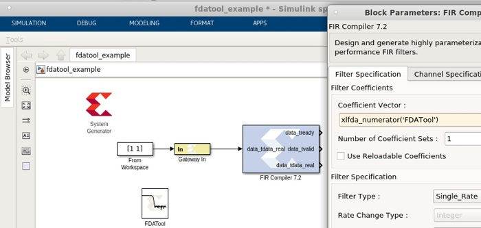

# FDATool

The FDATool block provides an interface to the FDATool software
available as part of the MATLAB® Signal Processing Toolbox.

  
  

## Description
The block does not function properly and should not be used if the
Signal Processing Toolbox is not installed. This block provides a means
of defining an FDATool object and storing it as part of a Model Composer
model. FDATool provides a powerful means for defining digital filters
with a graphical user interface.

### Example of Use

Copy an FDATool block into a Subsystem where you would like to define a
filter. Double-clicking the block icon opens up an FDATool session and
graphical user interface. The filter is stored in an data structure
internal to the FDATool interface block, and the coefficients can be
extracted using MATLAB® helper functions provided as part of Model
Composer. The function call xlfda_numerator('FDATool') returns the
numerator of the transfer function (e.g., the impulse response of a
finite impulse response filter) of the FDATool block named 'FDATool'.
Similarly, the helper function xlfda_denominator('FDATool') retrieves
the denominator for a non-FIR filter.

A typical use of the FDATool block is as a companion to an FIR filter
block, where the Coefficients field of the filter block is set to
xlfda_numerator('FDATool'). An example is shown in the following
diagram:

  
  

**Note** the xlfda_numerator() can equally well be used to initialize a
memory block or a 'coefficient' variable for a masked Subsystem
containing an FIR filter.

This block does not use any hardware resources.

### FDATool Interface

Double-clicking the icon in your Simulink model opens up an FDATool
session and its graphical user interface. Upon closing the FDATool
session, the underlying FDATool object is stored in the UserData
parameter of the FDATool block. Use the xlfda_numerator()
helper function and get_param() to extract information from the object
as desired.

--------------
Copyright (C) 2024 Advanced Micro Devices, Inc.
All rights reserved.

SPDX-License-Identifier: MIT
